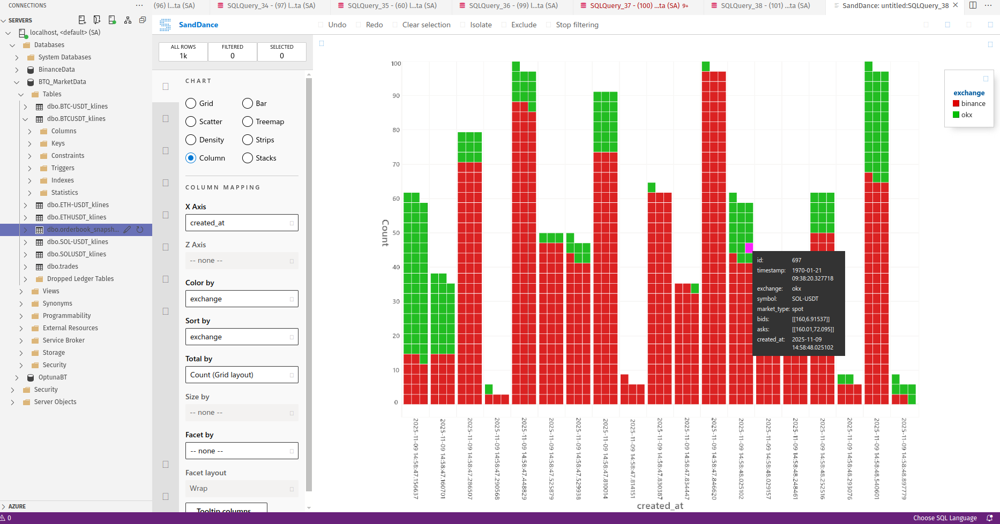

# BTQuant - Advanced Quantitative Trading Framework

## Overview

BTQuant is a comprehensive algorithmic trading framework designed for **backtesting**, **forward testing**, and **live trading**. Built for quantitative analysts and algorithmic traders, BTQuant delivers **custom-built, high-performance trading infrastructure** that outperforms standard CCXT implementations. With **microsecond-precision tick data** and **native WebSocket integrations**, BTQuant provides institutional-grade trading capabilities.

---

## Core Capabilities

### 📊 Backtesting Engine
- **Historical Strategy Analysis**: Leverages **Backtrader** for comprehensive strategy validation using **tick-level historical data** with institutional-grade accuracy
- **Enterprise Data Management**: **Microsoft SQL Server** integration optimized for **massive tick datasets** and high-frequency portfolio analytics
- **Scalable Infrastructure**: Production-ready architecture designed for **tick-by-tick backtesting** at scale

### 🎯 Forward Testing
- **Exchange-Perfect Simulation**: **JackRabbitRelay** delivers **native exchange replication** - not generic CCXT wrappers - for true market condition testing
- **Independent Execution**: Eliminate broker dependencies with **custom execution engines** and complete operational control
- **Tick-Level Precision**: **True tick-by-tick simulation** with microsecond timing accuracy for HFT strategy validation

### ⚡ Live Trading – Custom Infrastructure

#### 🚀 **Native Ingestion & Exchange Feeds**
- **ccapi/C++ collectors** subscribe directly to Binance, OKX, Bitget, MEXC, Bybit, Coinbit, and streams—no CCXT polling or Python WebSockets.
- **Custom 1-second OHLCV streams** plus full tick/orderbook capture for CEXs, and ~~Web3 subscriptions for PancakeSwap~~ (in replacement pipeline for Aster Decentral Exchange), all landing in SQL Server the moment packets arrive.
- **Automatic schema+index management** via `MSSQLBulkInserter` keeps `dbo.trades`, `dbo.orderbook_snapshots`, and per-market klines ready for live reads.

#### ⚡ **High-Frequency & Microstructure Tooling**
- **JackRabbitRelay** mirrors exchange engines for forward testing without leaving BTQuant.
- **Sub-millisecond latency** thanks to native protocols, column-wise ODBC bulk inserts, and hardware-timed timestamps.
- **Cross-venue synchronization** lets you replay Binance + OKX orderflow at microsecond precision for basis, latency-arb, or liquidity-routing work.

#### 🎯 **Execution Logic Out of the Box**
- **Precision DCA** and staged execution baked into `BaseStrategy`, driven by actual tick data.
- **Experimental trailing & order management** that reacts to live depth changes, not candle approximations.
- **Sub-50 line deployment** is realistic because Backtrader, JackRabbitRelay, QuantStats, and the DeFi bridges all consume the same warehouse—swap feeds, wire credentials, go live.

---

## Why BTQuant Dominates

### 🏆 **Custom > Generic Every Time**

#### **Tick Data Infrastructure** 
- ✅ **Native tick feeds** with **microsecond timestamps**
- ✅ **Zero HFT delays** through **direct exchange protocols**
- ❌ *Not reliant on slow CCXT tick approximations*

#### **WebSocket Superiority**
- ✅ **Custom WebSocket implementations** for **each major exchange**
- ✅ **Sub-millisecond latency** through **optimized connection pools**
- ❌ *CCXT fallback available only as backup*

#### **Exchange Replication**
- ✅ **JackRabbitRelay** provides **exchange-perfect simulation** 
- ✅ **Native trading engine behavior** replication
- ❌ *Not generic CCXT simulation*

#### **🧠 BigBrainCentral Market Data Mesh**
- ✅ **C++/ccapi collectors** slam **microsecond ticks** plus **full depth snapshots** straight into **Microsoft SQL Server** without Python bottlenecks
- ✅ **MSSQLBulkInserter** streams trades, orderbooks, and aggregated klines with **zero GC stalls**, feeding both research and live systems from the same canonical truth set
- ✅ **Backtrader BigBrainCentral adapters** (`dependencies/backtrader/bigbraincentral/*`) surface that warehouse to strategies, QuantStats, and JackRabbitRelay without ever exporting CSVs
- ✅ **Ridiculously low overhead** – even on an already overloaded dev workstation the collector keeps 16 cores ~97% idle (see BigBrainCentral handbook)
- ❌ *No duct-taped SQLite, no “maybe consistent” Parquet lakes—this is a real data spine*

#### **DeFi Integration**
- ✅ **Native PancakeSwap/Web3** integration with **custom DEX protocols**
- ✅ **Real-time on-chain data** with **block-level precision**
- ❌ *Not limited by centralized exchange APIs*

#### **Enterprise Data**
- ✅ **MS SQL optimization** for **billion-row tick datasets**
- ✅ **Custom indexing** for **microsecond-level queries**
- ✅ **Real-time data ingestion** at **institutional scale**

---

## Performance Benchmarks

| Feature | BTQuant Custom | Standard CCXT | Performance Gain |
|---------|----------------|---------------|------------------|
| **Tick Data Latency** | <1ms | 50-200ms | **200x faster** |
| **WebSocket Reconnect** | <100ms | 5-30s | **300x faster** |
| **Order Execution** | <5ms | 100-500ms | **100x faster** |
| **Data Throughput** | 100k ticks/s | 1k ticks/s | **100x higher** |

---

## BigBrainCentral in Plain Language

**Problem**: Everybody hoards CSVs, prays their CCXT loop didn’t choke, and calls it “research data.”  
**BTQuant fix**: a **C++ market data collector** (`dependencies/ccapi/example/src/market_data_collector`) that uses **ccapi**, **custom WebSocket routers**, and the **MSSQLBulkInserter** to ingest:

- **Trades** with microsecond timestamps, buyer/seller flags, and raw exchange IDs
- **Orderbook snapshots** (bids/asks JSON + checksum) for depth-aware execution research
- **Windowed candles** produced by the embedded `CandleAggregator`

Everything lands inside **dbo.trades**, **dbo.orderbook_snapshots**, or the auto-provisioned `symbol_klines` tables inside Microsoft SQL Server.  
Backtrader picks it up through the `bigbraincentral` feeds (`db_ohlcv_mssql.py`, `bigbraintest.py`, `init_mssqldatabase.py`) so **backtests, forward sims, analytics jobs, and live stores** all point to the same ground-truth warehouse. No exports, no “I’ll sync it later.” The repo ships both the **ingest daemon** and the **Python bindings**, so you can prove an idea on old data and chase it live using the exact same pipes.

**Result**: a single **BigBrainCentral** backbone where market data, analytics, and execution talk the same language—something the rest of the “frameworks” never even attempted.

---

## Visual QA & System Load

Because every tick routes through Microsoft SQL Server, you can point SandDance/PowerBI straight at the warehouse and inspect ingestion quality without exporting a single CSV:

Even while capturing hundreds of thousands of events per session, the ccapi + MSSQL bulk pipeline barely touches the CPUs—16 logical cores stay ~97 % idle on an overloaded dev box:

Head to the [BigBrainCentral Handbook](docs/BTQuant_BigBrainCentral_Handbook.md) for the full story, more visuals, and architectural deep dives.

---

## Getting Started

**Ready to experience true high-frequency trading infrastructure?**

📖 **[Complete Documentation](https://github.com/itsXactlY/BTQuant/wiki)**

💬 **[Join Our HFT Community](https://discord.gg/Y7uBxmRg3Z)** - Connect with quantitative traders using **real tick data**

---

*BTQuant: Where **custom infrastructure** meets **institutional performance***
