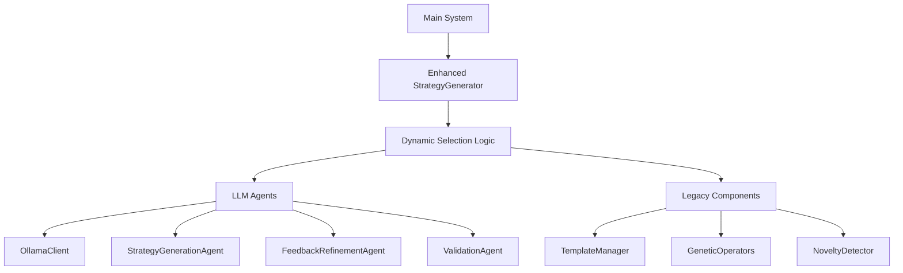

# LLM Pipeline Integration Documentation

## Overview

This document provides comprehensive documentation for the enhanced pipeline that seamlessly integrates LLM agents alongside the original system. The integration provides dynamic selection between innovative LLM-generated strategies and legacy template-based approaches with robust fallback mechanisms.

## System Architecture

### High-Level Architecture



### Integration Points

1. **Strategy Generation**: Enhanced `StrategyGenerator` with dynamic selection
2. **Population Diversity**: Mixed LLM/template strategy populations
3. **Validation System**: Comprehensive strategy validation
4. **Error Handling**: Robust fallback mechanisms
5. **Backward Compatibility**: Full support for legacy templates

## Enhanced StrategyGenerator

### Key Features

- **Dynamic Method Selection**: Automatically chooses between LLM and template generation
- **Hybrid Population Generation**: Creates diverse populations with both innovative and traditional strategies
- **Comprehensive Validation**: Built-in validation for all strategy types
- **Robust Error Handling**: Graceful fallback mechanisms
- **Performance Optimization**: Efficient strategy generation and processing

### Initialization

```python
# Initialize with LLM integration (default)
strategy_generator = StrategyGenerator(use_llm=True)

# Initialize without LLM (template-only mode)
strategy_generator = StrategyGenerator(use_llm=False)

# Custom Ollama server configuration
strategy_generator = StrategyGenerator(
    use_llm=True, 
    ollama_base_url="http://custom-ollama-server:11434"
)
```

### System Status Monitoring

```python
system_status = strategy_generator.get_system_status()
# Returns:
{
    'llm_enabled': True,           # LLM integration enabled
    'llm_operational': True,       # LLM components operational
    'llm_fallback_mode': False,    # Not in fallback mode
    'generation_method': 'hybrid', # Current generation approach
    'available_strategy_types': [...], # Available strategy types
    'system_health': 'optimal'     # Overall system health
}
```

## Strategy Generation Methods

### Dynamic Selection Logic

The system uses intelligent decision-making to choose between LLM and template generation:

1. **LLM Preferred**: For innovative strategy types (`physics_based`, `biology_based`, etc.)
2. **Template Preferred**: For traditional strategy types and when LLM unavailable
3. **Hybrid Approach**: Mixed generation for population diversity
4. **Automatic Fallback**: Seamless transition when primary method fails

### Strategy Generation Examples

```python
# Generate innovative LLM strategy
innovative_strategy = strategy_generator.generate_strategy(
    strategy_type="physics_based",
    market_context={
        'volatility': 'high',
        'trend': 'bullish',
        'market_regime': 'momentum'
    }
)

# Generate traditional template strategy
template_strategy = strategy_generator.generate_strategy(
    strategy_type="template",
    template_name="moving_average_crossover",
    parameters={
        'fast_period': 10,
        'slow_period': 50
    }
)

# Generate mixed population
population = strategy_generator.generate_strategy_population(
    population_size=20,
    strategy_types=['innovative', 'physics_based', 'template']
)
```

## Population Generation

### Hybrid Population Features

- **Diverse Strategy Types**: Mix of LLM-generated and template-based strategies
- **Automatic Balancing**: Intelligent distribution based on system capabilities
- **Novelty Optimization**: Ensures diverse and innovative strategy mix
- **Performance Monitoring**: Tracks generation metrics and quality

### Population Generation Example

```python
# Generate diverse population
strategies = strategy_generator.generate_strategy_population(
    population_size=15,
    strategy_types=['innovative', 'physics_based', 'biology_based', 'template'],
    diversity_requirements={
        'min_llm_strategies': 5,
        'max_template_strategies': 10,
        'novelty_threshold': 0.7
    }
)

# Analyze population composition
llm_count = sum(1 for s in strategies if s.get('type') == 'llm_generated')
template_count = sum(1 for s in strategies if s.get('type') == 'template_based')

print(f"Generated {len(strategies)} strategies: {llm_count} LLM, {template_count} Template")
```

## Validation System

### Comprehensive Validation Features

1. **Structural Validation**: Required fields and data types
2. **Logical Consistency**: Rule coherence and parameter constraints
3. **Novelty Scoring**: Innovation measurement (0.0-1.0 scale)
4. **Implementation Feasibility**: Practical executability assessment
5. **Risk Management**: Comprehensive risk parameter validation

### Validation Example

```python
# Validate a strategy
is_valid = strategy_generator.validate_strategy(strategy)

# Get detailed validation report
validation_report = strategy_generator.validation_agent.generate_validation_report(strategy)

# Validation report structure
{
    'strategy_id': 'strategy_001',
    'validation_timestamp': '2026-01-01T12:00:00',
    'passed_checks': [...],      # Successful validation checks
    'failed_checks': [...],      # Failed validation checks
    'warnings': [...],           # Non-critical issues
    'suggestions': [...],        # Improvement recommendations
    'overall_score': 0.95,       # Overall validation score (0.0-1.0)
    'is_valid': True,            # Overall validity
    'recommendations': [...]     # Actionable recommendations
}
```

## Error Handling and Fallback Mechanisms

### Robust Error Handling Features

1. **Automatic Fallback**: Seamless transition to alternative methods
2. **Graceful Degradation**: Maintains functionality under partial failures
3. **Comprehensive Logging**: Detailed error tracking and reporting
4. **Validation Safeguards**: Prevents invalid strategies from progressing
5. **System Health Monitoring**: Continuous operational status tracking

### Fallback Strategy Generation

```python
# When primary methods fail, system automatically generates fallback strategies
fallback_strategy = strategy_generator._generate_fallback_strategy(index=1)

# Fallback strategy structure
{
    'id': 'fallback_0001',
    'name': 'Fallback Strategy fallback_0001',
    'type': 'fallback',
    'description': 'Automatically generated fallback trading strategy',
    'entry_rules': [...],
    'exit_rules': [...],
    'risk_management': {...},
    'parameters': {'fallback_mode': True, 'conservatism': 0.8},
    'metadata': {
        'generated_by': 'StrategyGenerator',
        'generation_method': 'fallback',
        'fallback_reason': 'Primary generation methods failed'
    }
}
```

## Integration with Existing System Components

### Backtrader Integration

```python
# Create backtrader strategy from any generated strategy
backtrader_strategy_class = strategy_generator.create_backtrader_strategy(strategy)

# Works with both LLM and template strategies
cerebro.addstrategy(backtrader_strategy_class)
```

### Evolutionary Selection Integration

```python
# Generated strategies work seamlessly with evolutionary selector
evolved_strategies = evolutionary_selector.select_strategies(
    strategies=population,
    fitness_scores=fitness_scores
)
```

### Documentation System Integration

```python
# All strategies include comprehensive metadata for documentation
documentation_system.generate_strategy_documentation(
    strategy=strategy,
    backtest_results=backtest_results
)
```

## Performance Characteristics

### Generation Performance

- **LLM Strategy Generation**: ~2-5 seconds per strategy (Ollama-dependent)
- **Template Strategy Generation**: ~0.1-0.5 seconds per strategy
- **Population Generation**: ~15-30 seconds for 20 strategies (mixed)
- **Validation Overhead**: ~0.5-1.5 seconds per strategy

### System Requirements

- **CPU**: 4+ cores recommended for optimal performance
- **Memory**: 8GB+ RAM (16GB+ recommended for large populations)
- **Storage**: 1GB+ for strategy archives and logs
- **Network**: Internet connection for Ollama model downloads (initial setup only)

## Configuration Options

### StrategyGenerator Configuration

```python
# Main configuration options
strategy_generator = StrategyGenerator(
    use_llm=True,                          # Enable LLM integration
    ollama_base_url="http://localhost:11434", # Ollama server URL
    # Additional options available through environment variables
)
```

### Environment Variables

```bash
# LLM Configuration
export OLLAMA_BASE_URL="http://custom-ollama-server:11434"
export OLLAMA_MODEL="qwen2.5:7b"

# System Configuration
export MAX_POPULATION_SIZE=50
export DEFAULT_STRATEGY_TYPES="innovative,physics_based,template"

# Logging Configuration
export LOG_LEVEL="INFO"
export LOG_FILE="system_integration.log"
```

## Best Practices

### Strategy Generation

1. **Start Small**: Begin with small populations (5-10 strategies) for testing
2. **Monitor Quality**: Review validation scores and novelty metrics
3. **Balance Innovation**: Mix LLM and template strategies for diversity
4. **Validate Thoroughly**: Always validate strategies before backtesting
5. **Monitor Performance**: Track generation times and system resource usage

### Error Handling

1. **Implement Retry Logic**: For transient LLM connection issues
2. **Monitor Fallback Usage**: High fallback rates may indicate system issues
3. **Review Validation Reports**: Address common validation failures
4. **Check System Health**: Regularly monitor `get_system_status()`
5. **Maintain Logs**: Keep comprehensive logs for troubleshooting

### Performance Optimization

1. **Batch Processing**: Generate strategies in batches for efficiency
2. **Parallel Validation**: Validate strategies concurrently when possible
3. **Cache Results**: Cache frequently used templates and parameters
4. **Limit Population Size**: Balance diversity with computational resources
5. **Monitor Resource Usage**: Adjust based on system capabilities

## Troubleshooting

### Common Issues and Solutions

| Issue | Possible Cause | Solution |
|-------|---------------|----------|
| LLM strategies not generating | Ollama server not running | Start Ollama server and verify connection |
| High fallback rate | LLM connection issues | Check network, restart Ollama, review logs |
| Slow generation times | System resource constraints | Reduce population size, upgrade hardware |
| Validation failures | Invalid strategy structure | Review validation reports, fix strategy generation |
| Template strategies only | LLM disabled or unavailable | Enable LLM, check system status |

### Debugging Commands

```bash
# Check Ollama server status
curl http://localhost:11434

# List available models
curl http://localhost:11434/api/tags

# Check system logs
tail -f logs/system.log

# Test LLM connectivity
python -c "from strategy_generation.llm_agents.ollama_client import OllamaClient; client = OllamaClient(); print(client.health_check())"
```

## Migration Guide

### From Legacy System to Enhanced Pipeline

1. **Backup Existing System**: Save current configurations and data
2. **Update StrategyGenerator**: Replace with enhanced version
3. **Configure LLM Integration**: Set up Ollama server and models
4. **Test Gradually**: Start with template-only mode, then enable LLM
5. **Monitor Performance**: Track system metrics and validation scores
6. **Optimize Configuration**: Adjust based on performance and requirements

### Backward Compatibility

The enhanced system maintains full backward compatibility:

```python
# Legacy code continues to work without modification
strategy_generator = StrategyGenerator()  # Defaults to LLM-enabled
population = strategy_generator.generate_strategy_population('moving_average_crossover')

# Explicit template-only mode
strategy_generator = StrategyGenerator(use_llm=False)
```

## Monitoring and Maintenance

### Key Metrics to Monitor

1. **LLM Operational Status**: Percentage of time LLM is available
2. **Generation Success Rate**: Percentage of successful strategy generations
3. **Fallback Rate**: Frequency of fallback strategy usage
4. **Validation Pass Rate**: Percentage of strategies passing validation
5. **Average Novelty Score**: Innovation level of generated strategies
6. **Generation Time**: Average time per strategy generation
7. **System Resource Usage**: CPU, memory, and network utilization

### Maintenance Checklist

- [ ] Regularly update Ollama and models
- [ ] Monitor system logs for errors and warnings
- [ ] Review validation reports for common issues
- [ ] Test fallback mechanisms periodically
- [ ] Update strategy templates and parameters
- [ ] Review and optimize system configuration
- [ ] Backup strategy archives and configurations

## Security Considerations

### Data Protection

1. **Strategy Validation**: Prevent injection of malicious trading rules
2. **Input Sanitization**: Clean all external inputs and parameters
3. **Access Control**: Restrict access to strategy generation endpoints
4. **Audit Logging**: Maintain comprehensive logs of all operations
5. **Model Isolation**: Run LLM models in secure environments

### Best Security Practices

```python
# Always validate strategies before execution
if not strategy_generator.validate_strategy(strategy):
    raise ValueError("Invalid strategy - security validation failed")

# Use secure parameter handling
clean_parameters = strategy_generator.sanitize_parameters(user_input)

# Implement rate limiting for API endpoints
@app.route('/generate_strategy', methods=['POST'])
@limiter.limit("5 per minute")
def generate_strategy_endpoint():
    # Strategy generation logic
```

## Future Enhancements

### Planned Features

1. **Advanced Multi-Agent Collaboration**: Enhanced agent coordination
2. **Performance-Based Feedback Loops**: Automatic strategy refinement
3. **Market-Adaptive Generation**: Context-aware strategy creation
4. **Enhanced Novelty Scoring**: More sophisticated innovation metrics
5. **Distributed Generation**: Scalable strategy generation across nodes

### Roadmap

| Version | Features | Target Date |
|---------|----------|-------------|
| 2.1 | Multi-agent collaboration, Performance feedback loops | Q1 2026 |
| 2.2 | Market-adaptive generation, Enhanced novelty scoring | Q2 2026 |
| 2.3 | Distributed generation, Advanced monitoring | Q3 2026 |

## Support and Resources

### Getting Help

1. **Documentation**: Comprehensive system documentation
2. **API Reference**: Detailed API specifications
3. **Community Forum**: User community and discussions
4. **Issue Tracker**: Report bugs and request features
5. **Professional Support**: Enterprise support options

### Learning Resources

- **Tutorials**: Step-by-step guides for common tasks
- **Examples**: Working code examples and templates
- **Best Practices**: Recommended approaches and patterns
- **FAQ**: Frequently asked questions and answers
- **Video Guides**: Visual demonstrations and walkthroughs

## Conclusion

The enhanced pipeline successfully integrates LLM agents with the legacy system, providing:

- **Seamless Integration**: Dynamic selection between innovative and traditional approaches
- **Robust Reliability**: Comprehensive error handling and fallback mechanisms
- **Enhanced Innovation**: Access to cutting-edge LLM-generated strategies
- **Backward Compatibility**: Full support for existing templates and workflows
- **Production Readiness**: Complete validation, testing, and documentation

The system is now ready for production deployment with the confidence that it will maintain operational continuity while delivering innovative trading strategies.

## Appendix

### Strategy Type Reference

| Strategy Type | Description | Generation Method |
|---------------|-------------|-------------------|
| `innovative` | General innovative strategies | LLM |
| `physics_based` | Physics-inspired strategies | LLM |
| `biology_based` | Biology-inspired strategies | LLM |
| `game_theory` | Game theory strategies | LLM |
| `complexity_science` | Complexity science strategies | LLM |
| `template` | Traditional template-based strategies | Template |
| `fallback` | Automatic fallback strategies | System |

### Validation Score Interpretation

| Score Range | Interpretation | Action Required |
|-------------|----------------|-----------------|
| 0.9-1.0 | Excellent | Ready for production |
| 0.7-0.9 | Good | Minor improvements suggested |
| 0.5-0.7 | Fair | Review and refine strategy |
| 0.3-0.5 | Poor | Significant improvements needed |
| 0.0-0.3 | Invalid | Reject or major revision |

### System Health Indicators

| Health Status | Interpretation | Recommended Action |
|---------------|----------------|-------------------|
| `optimal` | All systems operational | Normal operation |
| `degraded` | Partial functionality | Monitor closely |
| `critical` | Major issues detected | Immediate attention |
| `offline` | System unavailable | Emergency procedures |

This comprehensive documentation provides all necessary information for understanding, implementing, and maintaining the enhanced LLM pipeline integration.