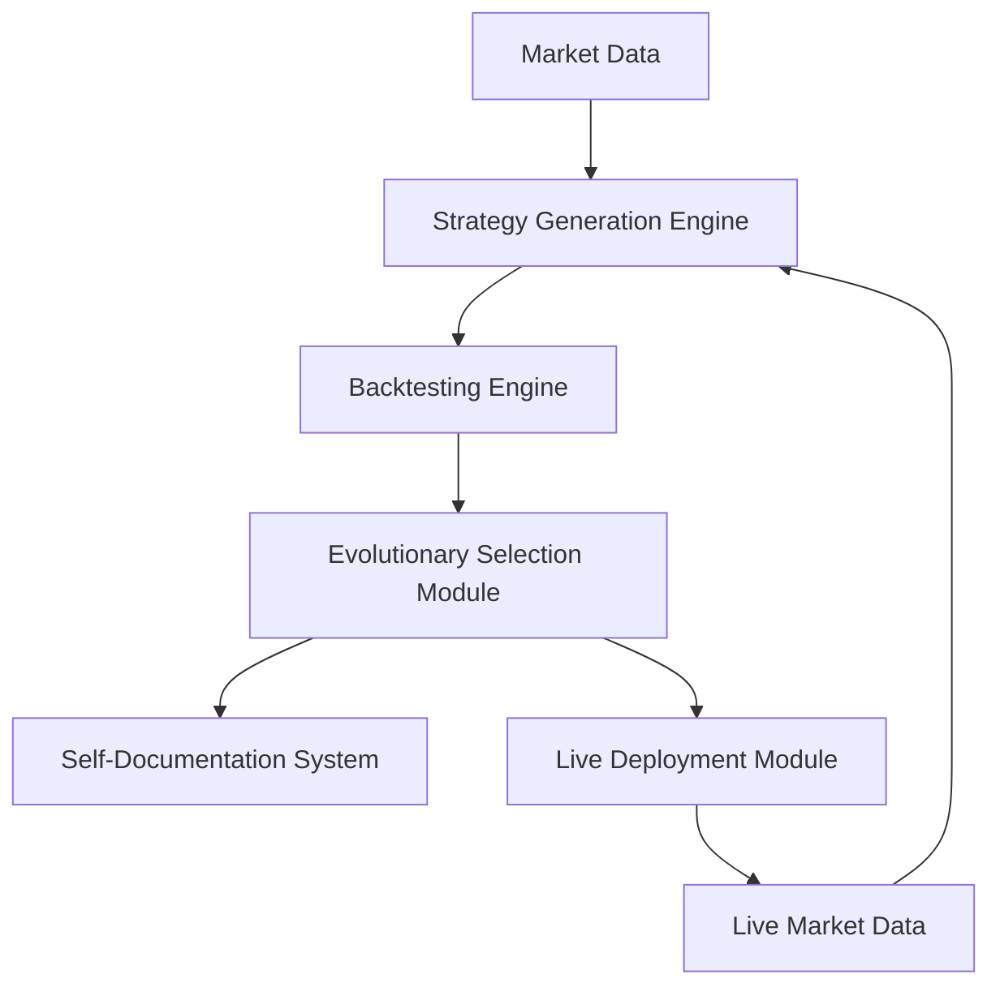

# High-Level Architecture for Autonomous Quantitative Research Agency

## Overview
The system is designed as a perpetual motion engine for strategy innovation, leveraging the backtrader framework for strategy generation and backtesting. The architecture emphasizes modularity, computational efficiency, and self-documentation.

## Core System Components

### 1. Strategy Generation Engine
- **Purpose**: Automatically generates trading strategies based on predefined rules, market conditions, and historical data.
- **Key Features**:
  - Rule-based strategy templates
  - Parameterized strategy generation
  - Integration with backtrader for strategy validation

### 2. Backtesting Engine
- **Purpose**: Validates generated strategies using historical data to assess performance and robustness.
- **Key Features**:
  - Integration with backtrader framework
  - Parallel backtesting for efficiency
  - Performance metrics and risk assessment

### 3. Evolutionary Selection Module
- **Purpose**: Uses evolutionary algorithms to select and refine the best-performing strategies.
- **Key Features**:
  - Genetic algorithms for strategy optimization
  - Fitness functions based on performance metrics
  - Adaptive selection criteria

### 4. Self-Documentation System
- **Purpose**: Automatically documents strategies, backtesting results, and evolutionary processes.
- **Key Features**:
  - Auto-generated reports and logs
  - Version control for strategies
  - Knowledge base for historical performance

### 5. Live Deployment Module
- **Purpose**: Deploys selected strategies to live trading environments.
- **Key Features**:
  - Integration with trading platforms
  - Real-time monitoring and performance tracking
  - Risk management and fail-safes

## Data Flow Architecture

### Data Flow Diagram

### Key Data Flows
1. **Market Data Ingestion**: Historical and real-time market data is fed into the Strategy Generation Engine.
2. **Strategy Generation**: Strategies are generated and passed to the Backtesting Engine.
3. **Backtesting**: Strategies are validated using historical data, and results are sent to the Evolutionary Selection Module.
4. **Evolutionary Selection**: The best strategies are selected and refined, with documentation generated by the Self-Documentation System.
5. **Live Deployment**: Selected strategies are deployed to live trading environments, with real-time data feeding back into the system for continuous improvement.

## Key Algorithms

### Evolutionary Algorithm
- **Genetic Algorithm**: Used for optimizing strategy parameters and selecting the best-performing strategies.
- **Fitness Function**: Based on performance metrics such as Sharpe ratio, drawdown, and profitability.
- **Selection Criteria**: Adaptive criteria that evolve based on market conditions and historical performance.

### Backtesting Algorithm
- **Parallel Backtesting**: Utilizes parallel processing to efficiently backtest multiple strategies simultaneously.
- **Performance Metrics**: Includes Sharpe ratio, maximum drawdown, win rate, and risk-adjusted returns.

## Modular Design

### Component Interactions
- **Strategy Generation Engine**: Interacts with the Backtesting Engine to validate strategies.
- **Backtesting Engine**: Provides performance data to the Evolutionary Selection Module.
- **Evolutionary Selection Module**: Selects strategies for deployment and documentation.
- **Self-Documentation System**: Records all processes and outcomes for future reference.
- **Live Deployment Module**: Executes strategies in live markets and provides feedback to the system.

### Modularity Benefits
- **Scalability**: Components can be scaled independently based on computational needs.
- **Maintainability**: Each module can be updated or replaced without affecting the entire system.
- **Flexibility**: New algorithms or data sources can be integrated with minimal disruption.

## Computational Efficiency

### Parallel Processing
- **Backtesting**: Parallel execution of backtests to reduce computation time.
- **Evolutionary Selection**: Parallel evaluation of strategies to speed up the selection process.

### Resource Management
- **Dynamic Resource Allocation**: Allocates computational resources based on the current workload.
- **Caching**: Caches frequently used data and strategies to reduce redundant computations.

## Self-Documentation

### Auto-Generated Reports
- **Strategy Reports**: Detailed reports on strategy performance and parameters.
- **Backtesting Reports**: Comprehensive logs of backtesting results and metrics.
- **Evolutionary Reports**: Documentation of the evolutionary process and selected strategies.

### Knowledge Base
- **Historical Data**: Stores historical market data and strategy performance.
- **Strategy Library**: Maintains a library of past strategies and their outcomes.

## Live Deployment

### Integration with Trading Platforms
- **API Integration**: Connects to trading platforms via APIs for live execution.
- **Real-Time Monitoring**: Tracks live performance and adjusts strategies as needed.

### Risk Management
- **Fail-Safes**: Implements fail-safes to prevent catastrophic losses.
- **Performance Tracking**: Continuously monitors live performance and provides feedback to the system.

## Technical Specification

### System Requirements
- **Programming Language**: Python (for integration with backtrader)
- **Frameworks**: backtrader, NumPy, Pandas, SciPy
- **Data Storage**: SQLite or PostgreSQL for historical data and strategy logs
- **Computational Resources**: High-performance computing for parallel backtesting and evolutionary selection

### Component Specifications

#### Strategy Generation Engine
- **Input**: Market data (historical and real-time), strategy templates
- **Output**: Parameterized trading strategies
- **Algorithms**: Rule-based generation, parameter optimization

#### Backtesting Engine
- **Input**: Generated strategies, historical market data
- **Output**: Performance metrics, risk assessment
- **Algorithms**: Parallel backtesting, performance evaluation

#### Evolutionary Selection Module
- **Input**: Backtesting results, performance metrics
- **Output**: Optimized strategies, selection logs
- **Algorithms**: Genetic algorithms, fitness functions

#### Self-Documentation System
- **Input**: Strategy parameters, backtesting results, evolutionary logs
- **Output**: Auto-generated reports, knowledge base entries
- **Algorithms**: Report generation, version control

#### Live Deployment Module
- **Input**: Selected strategies, real-time market data
- **Output**: Live trading execution, performance tracking
- **Algorithms**: Risk management, real-time monitoring

### Data Flow Details
- **Market Data Ingestion**: Data is ingested from external sources and stored in a centralized database.
- **Strategy Generation**: Strategies are generated based on templates and historical data.
- **Backtesting**: Strategies are backtested in parallel to evaluate performance.
- **Evolutionary Selection**: Strategies are optimized using genetic algorithms based on performance metrics.
- **Live Deployment**: Optimized strategies are deployed to live trading environments with real-time monitoring.

### Performance Metrics
- **Sharpe Ratio**: Measures risk-adjusted returns.
- **Maximum Drawdown**: Assesses the largest drop in strategy performance.
- **Win Rate**: Evaluates the percentage of profitable trades.
- **Risk-Adjusted Returns**: Combines profitability and risk assessment.

### Risk Management
- **Fail-Safes**: Automated stop-loss mechanisms to limit losses.
- **Performance Tracking**: Real-time monitoring of live strategy performance.
- **Adaptive Criteria**: Evolutionary selection criteria that adapt to market conditions.

## Conclusion
This architecture provides a comprehensive framework for an autonomous quantitative research agency, leveraging the backtrader framework for strategy generation and backtesting. The modular design ensures scalability, maintainability, and flexibility, while the evolutionary selection process drives continuous innovation.