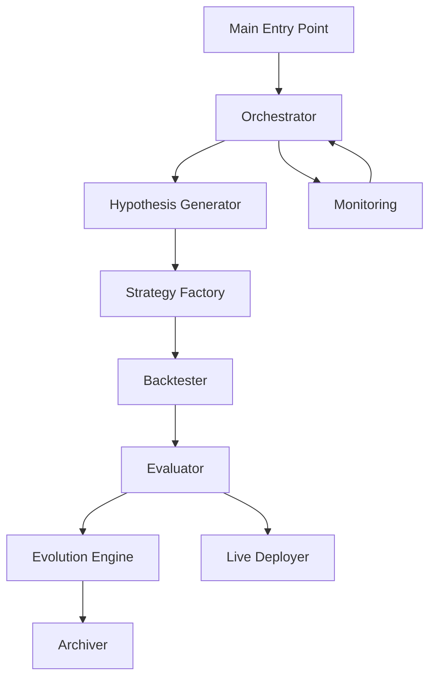
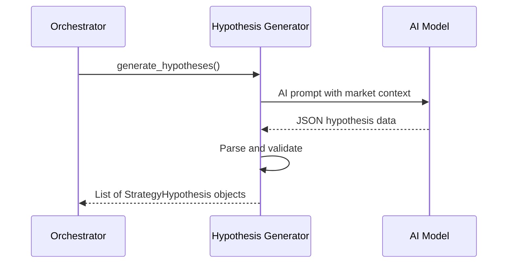
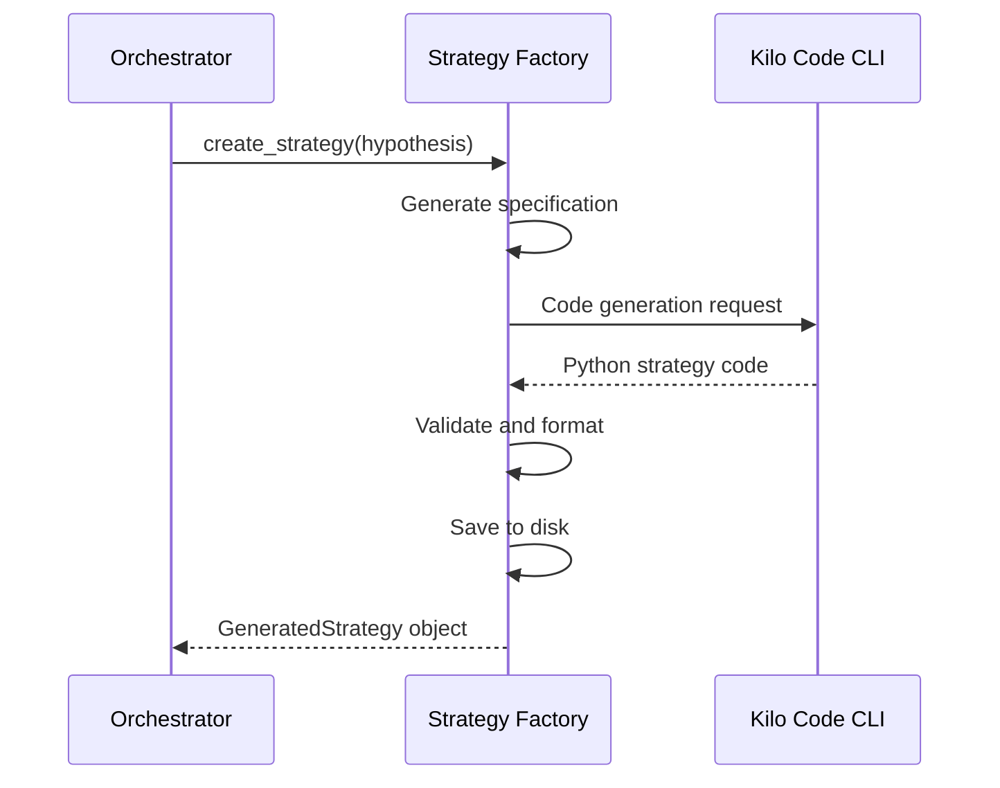
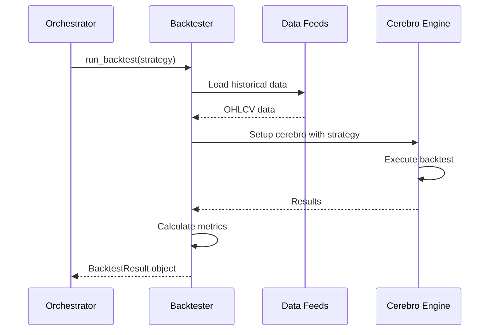
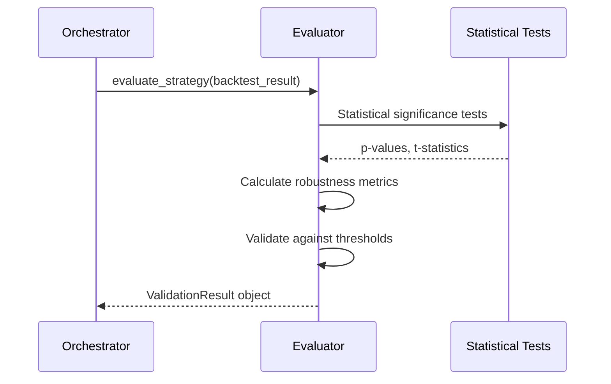
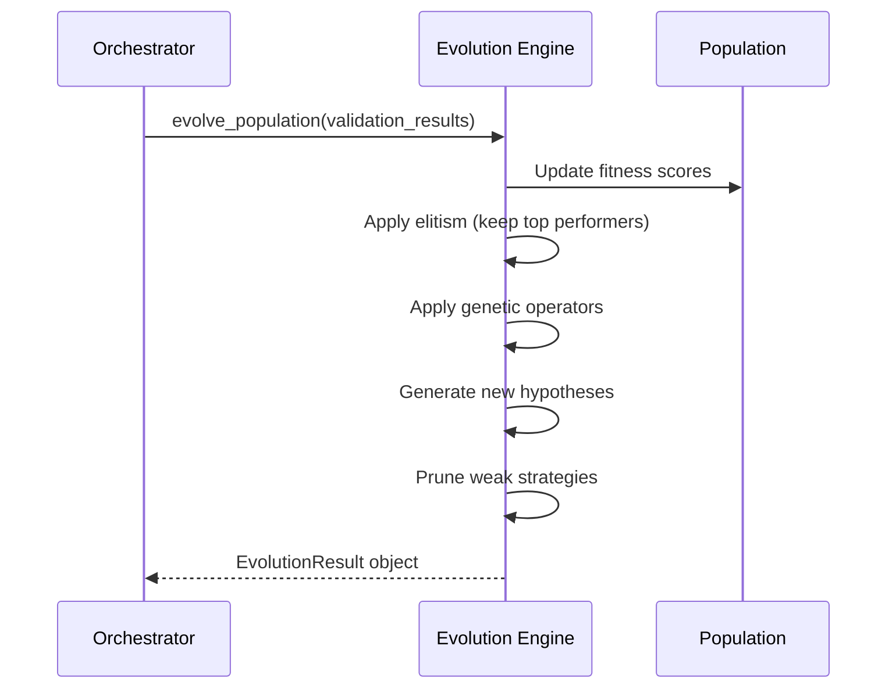
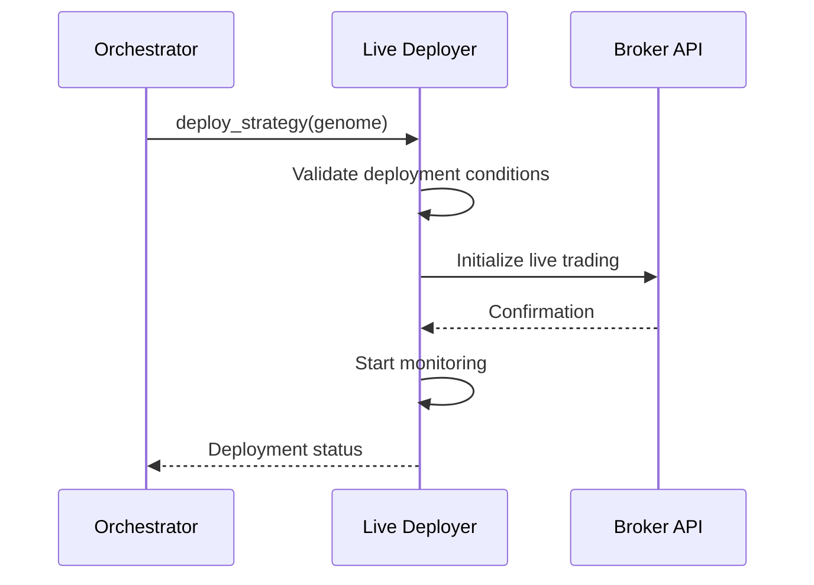
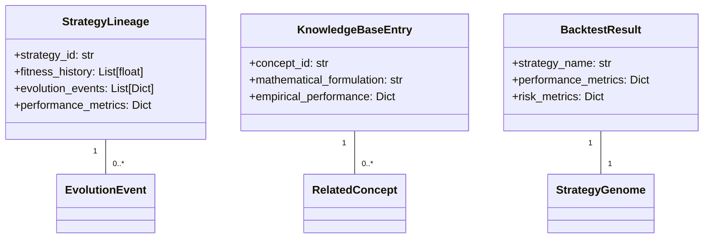

# Autonomous Quantitative Research Agency - Diagnostic Report

## Executive Summary

This report presents a comprehensive diagnostic analysis of the Autonomous Quantitative Research Agency's architecture, workflows, data flows, and potential bottlenecks. The system is a sophisticated perpetual motion engine for quantitative trading strategy innovation.

## System Architecture Overview

### Core Components

1. **Main Entry Point**: `run_agency.py` - Orchestrates the entire system
2. **Configuration**: `autonomous_agency/config.py` - Centralized configuration management
3. **Core Modules**:
   - `orchestrator.py` - Main control loop and scheduling
   - `hypothesis_generator.py` - AI-powered strategy hypothesis generation
   - `strategy_factory.py` - Code generation from hypotheses
   - `backtester.py` - Comprehensive backtesting engine
   - `evaluator.py` - Statistical validation and performance analysis
   - `evolution_engine.py` - Genetic algorithm-based strategy evolution
   - `archiver.py` - Documentation and knowledge base management
   - `live_deployer.py` - Live trading deployment with risk controls
   - `monitoring.py` - System health monitoring and alerting

### Architecture Diagram

## Workflow Analysis

### 1. Hypothesis Generation Workflow

**Data Flow**:
- Input: Market context, strategy types, complexity levels
- Process: AI model generates creative trading hypotheses
- Output: Structured hypothesis objects with mathematical beauty scores

### 2. Strategy Creation Workflow

**Data Flow**:
- Input: StrategyHypothesis object
- Process: Code generation, validation, formatting
- Output: Executable Python strategy files

### 3. Backtesting Workflow

**Data Flow**:
- Input: GeneratedStrategy + data configuration
- Process: Historical data loading, strategy execution, metrics calculation
- Output: Comprehensive performance metrics

### 4. Evaluation Workflow

**Data Flow**:
- Input: BacktestResult object
- Process: Statistical validation, robustness analysis, threshold checking
- Output: Validation decision with detailed metrics

### 5. Evolution Workflow

**Data Flow**:
- Input: Validation results from current population
- Process: Fitness scoring, genetic operations, population management
- Output: New generation of evolved strategies

### 6. Live Deployment Workflow

**Data Flow**:
- Input: Validated StrategyGenome
- Process: Risk validation, capital allocation, live trading initialization
- Output: Active deployment with real-time monitoring

## Data Flow Analysis

### Critical Data Paths

1. **Hypothesis → Strategy → Backtest → Evaluation → Evolution**
   - Primary innovation pipeline
   - High data volume with complex transformations

2. **Performance Metrics → Decision Making**
   - Critical for evolution and deployment decisions
   - Requires high data integrity

3. **Live Trading → Monitoring → Risk Management**
   - Real-time data flow with safety implications
   - Low latency requirements

### Data Storage Architecture

## Bottleneck Analysis

### 1. AI Hypothesis Generation

**Potential Issues**:
- **API Latency**: External AI model calls can be slow
- **Rate Limiting**: API call limits may constrain throughput
- **Quality Variability**: Inconsistent hypothesis quality affects downstream processes

**Evidence**:
- `hypothesis_generator.py:108` - External HTTP calls to AI endpoint
- `hypothesis_generator.py:208` - Network-dependent operations

**Impact**: Delays in the innovation pipeline, reduced system throughput

### 2. Code Generation with Kilo Code CLI

**Potential Issues**:
- **Subprocess Overhead**: CLI calls have significant overhead
- **Error Handling**: Complex error recovery for failed generations
- **Validation Bottleneck**: Syntax validation can be slow for complex strategies

**Evidence**:
- `strategy_factory.py:134` - Subprocess calls to external CLI
- `strategy_factory.py:196` - Complex validation logic

**Impact**: Strategy creation delays, potential for failed generations

### 3. Backtesting Performance

**Potential Issues**:
- **Data Loading**: Large historical datasets can be slow to load
- **Parallelization Limits**: Thread pool constraints on concurrent backtests
- **Memory Usage**: High memory consumption for complex strategies

**Evidence**:
- `backtester.py:650` - Process pool with limited workers
- `backtester.py:256` - Multiple data source loading

**Impact**: Long backtest cycles, reduced evolution speed

### 4. Evolution Engine Complexity

**Potential Issues**:
- **Population Size**: Large populations increase computational load
- **Genetic Operations**: Complex crossover and mutation logic
- **Fitness Calculation**: Expensive metrics computation

**Evidence**:
- `evolution_engine.py:400` - Population sorting and processing
- `evolution_engine.py:620` - Complex diversity calculations

**Impact**: Slow evolution cycles, reduced innovation rate

### 5. Live Deployment Risk Management

**Potential Issues**:
- **Real-time Monitoring**: High-frequency performance checks
- **Risk Calculation**: Complex risk metric computations
- **Emergency Procedures**: Rapid shutdown requirements

**Evidence**:
- `live_deployer.py:110` - Continuous monitoring loop
- `live_deployer.py:226` - Complex risk threshold checking

**Impact**: System resource contention, potential for delayed risk responses

## Logical Inconsistencies

### 1. Error Handling Inconsistencies

**Issue**: Mixed error handling approaches across modules
- Some modules use comprehensive try-catch blocks
- Others have minimal error handling
- Inconsistent logging patterns

**Evidence**:
- `orchestrator.py:150` - Comprehensive error handling
- `hypothesis_generator.py:144` - Basic error handling

### 2. Configuration Management

**Issue**: Scattered configuration across multiple files
- Some settings in `config.py`
- Others hardcoded in module files
- Inconsistent default values

**Evidence**:
- `config.py:23` - AI model configuration
- `backtester.py:20` - Hardcoded configuration imports

### 3. State Management

**Issue**: Distributed state management without clear ownership
- Orchestrator manages some state
- Individual modules manage their own state
- Potential for state inconsistency

**Evidence**:
- `orchestrator.py:92` - Agency status tracking
- `evolution_engine.py:347` - Population state management

### 4. Resource Management

**Issue**: Potential resource leaks in long-running processes
- Thread pools not always properly cleaned up
- Database connections may not be closed
- File handles may be left open

**Evidence**:
- `orchestrator.py:100` - Thread pool creation
- `backtester.py:667` - Process pool usage

## Performance Optimization Opportunities

### 1. Caching Layer

**Recommendation**: Implement caching for:
- AI-generated hypotheses (with quality filtering)
- Backtest results for common parameter combinations
- Strategy code templates

### 2. Parallel Processing

**Recommendation**: Enhance parallelization:
- Increase thread pool sizes based on system capacity
- Implement distributed backtesting
- Use async I/O for network operations

### 3. Resource Optimization

**Recommendation**: Improve resource usage:
- Implement connection pooling for database access
- Add memory profiling and optimization
- Optimize data structures for performance

### 4. Monitoring Enhancements

**Recommendation**: Add detailed performance monitoring:
- Track bottleneck metrics in real-time
- Implement adaptive resource allocation
- Add performance trend analysis

## Security Considerations

### 1. Input Validation

**Issue**: Incomplete input validation in several modules
- AI-generated code execution risks
- External data source vulnerabilities

**Evidence**:
- `strategy_factory.py:204` - Code validation logic
- `backtester.py:256` - Data loading from multiple sources

### 2. Error Exposure

**Issue**: Detailed error messages may expose internal structure
- Stack traces in logs
- Configuration details in error messages

**Evidence**:
- `orchestrator.py:154` - Error logging with stack traces
- `live_deployer.py:99` - Detailed error logging

## Recommendations

### Immediate Actions

1. **Implement Comprehensive Logging**: Standardize logging across all modules
2. **Add Performance Monitoring**: Track key performance metrics in real-time
3. **Enhance Error Handling**: Implement consistent error handling patterns
4. **Optimize Resource Usage**: Add connection pooling and memory management

### Medium-Term Improvements

1. **Implement Caching Layer**: Reduce redundant computations
2. **Enhance Parallelization**: Scale backtesting and evolution processes
3. **Improve Configuration Management**: Centralize all configuration settings
4. **Add Health Checks**: Implement system health monitoring

### Long-Term Architecture

1. **Microservices Migration**: Consider breaking into specialized services
2. **Distributed Computing**: Implement distributed backtesting and evolution
3. **Advanced Monitoring**: Add AI-based anomaly detection
4. **Automated Scaling**: Implement auto-scaling based on workload

## Conclusion

The Autonomous Quantitative Research Agency demonstrates a sophisticated architecture for perpetual strategy innovation. While the system is well-designed, several bottlenecks and logical inconsistencies have been identified that could impact performance and reliability. The recommendations provided address these issues with a phased approach to ensure continuous improvement while maintaining system stability.

The system's greatest strengths lie in its comprehensive workflow design and modular architecture, which provide a solid foundation for future enhancements and scaling.