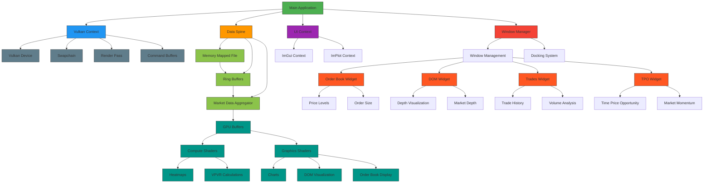
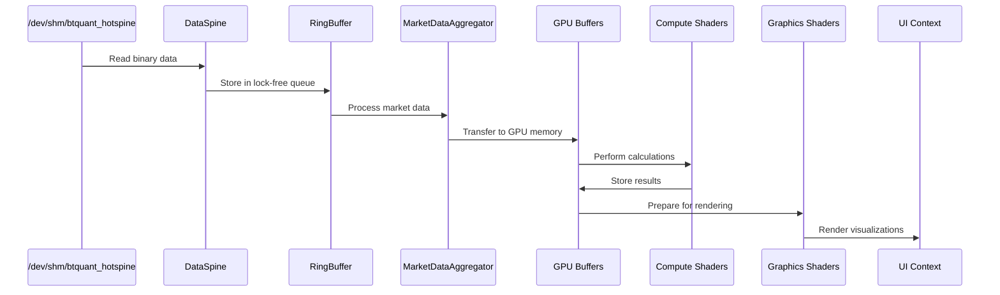

# btquant_vulkan Architektur

## Überblick
Das btquant_vulkan Projekt ist eine High-Frequency Trading-Anwendung mit Vulkan-GPU-Rendering Engine.

## Systemarchitektur

## Datenfluss

## Komponentenbeschreibung

### 1. Datenverarbeitungsschicht
- **DataSpine**: Verwaltet den Zugriff auf die binären Daten in `/dev/shm/btquant_hotspine`
- **RingBuffer**: Lockfreie Warteschlangen für Datenfluss
- **MarketDataAggregator**: Verarbeitet und aggregiert Marktinformationen

### 2. Rendering-Schicht
- **VulkanContext**: Vulkan-Initialisierung und Geräteverwaltung
- **RenderPipeline**: Render-Pipeline für Vulkan
- **GPU Buffers**: Speicher für GPU-Visualisierungen

### 3. UI-Schicht
- **UI Context**: ImGui Vulkan Integration
- **Window Manager**: Fenster- und Docking-System
- **Widgets**: Spezifische UI-Komponenten

### 4. Compute Shaders
- **Heatmaps**: Temperaturvisualisierungen
- **VPVR Calculations**: Volume Profile Value Range Berechnungen

## Datenformat
Das Binärformat von `/dev/shm/btquant_hotspine`:
- Header: "UQTB" Magic (4 Bytes) + Version + Symbol Count
- Daten beginnen bei 0x1000, pro Symbol:
  - bid_price, ask_price (double)
  - bid_size, ask_size (double)
  - timestamp (uint64, Mikrosekunden)
  - seq (uint32)