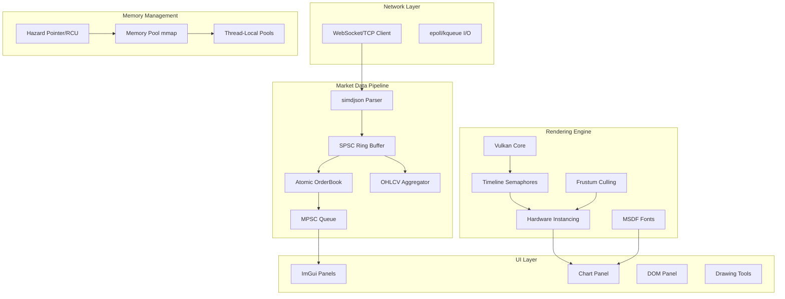

# Trading Terminal Implementation Plan - BTQ_Render_Engine Enhancement

## Executive Summary

Dieser Plan beschreibt die Erweiterung der bestehenden `BTQ_Render_Engine` zu einem ultra-low-latency Trading Terminal mit TradingView-tier Charting. Die Analyse zeigt, dass viele Komponenten bereits implementiert sind und erweitert werden müssen.

## Current Implementation Status

### Already Implemented
| Component | File | Status |
|-----------|------|--------|
| C++26 Standard | `CMakeLists.txt:9` | ✅ Complete |
| Vulkan SDK Integration | `CMakeLists.txt:17` | ✅ Complete |
| ImGui/ImPlot | `CMakeLists.txt:34-37` | ✅ Complete |
| Lock-free SPSC Ring Buffer | `lockfree_queue.hpp:26` | ✅ Complete |
| Lock-free MPSC Queue | `lockfree_queue.hpp:327` | ✅ Complete |
| Memory Pool with mmap | `memory_pool.hpp` | ✅ Complete |
| Vulkan Core | `vulkan_base_types.hpp` | ✅ Complete |
| Chart Panel | `chart_panel.cpp` | ✅ Complete |
| Orderbook Panel | `orderbook_panel.cpp` | ✅ Complete |
| Volume Profile Panel | `volume_profile_panel.cpp` | ✅ Complete |
| Drawing Tools | `drawing_tools.cpp` | ✅ Partial |
| Technical Indicators | `indicator.hpp` | ✅ Complete |

### Missing/Incomplete
| Component | Priority | Complexity |
|-----------|----------|------------|
| simdjson Integration | High | Medium |
| Hazard Pointer/RCU | High | High |
| CPU Core Pinning | Medium | Low |
| Double-buffered Atomic OrderBook | High | Medium |
| Timeline Semaphores | Medium | Medium |
| MSDF Font Rendering | Medium | High |
| Hardware Instancing for Candlesticks | High | High |
| Frustum Culling | Medium | Medium |
| Tick-to-Photon Latency Monitoring | Low | Medium |

---

## Architecture Overview



---

## Phase 1: C++26 Core Foundation Enhancement

### 1.1 CMake Optimization Flags
**Current State:** C++26 standard is set, but optimization flags are minimal.
**Required Changes:**
- Add `-O3 -march=native -flto` for release builds
- Add `-ffast-math` for indicator calculations (with caution)
- Enable PGO (Profile-Guided Optimization) support

### 1.2 simdjson Integration
**Rationale:** nlohmann/json is flexible but slow. simdjson provides SIMD-accelerated parsing.
**Implementation:**
- Add simdjson via FetchContent in CMakeLists.txt
- Create `simdjson_parser.hpp` wrapper for exchange-specific message formats
- Replace nlohmann/json on hot path only (market data parsing)
- Keep nlohmann/json for config files and non-critical paths

### 1.3 Hazard Pointer/RCU Implementation
**Rationale:** Lock-free queues need safe memory reclamation to prevent use-after-free.
**Implementation:**
- Create `hazard_pointer.hpp` with thread-local hazard pointer records
- Implement `HPRecord` with atomic pointer and retirement list
- Integrate with existing `MPSCQueue` node deletion
- Alternative: Use `std::shared_ptr` with atomic operations (simpler but slower)

### 1.4 CPU Core Pinning
**Rationale:** Reduce context switching for market data thread.
**Implementation:**
- Create `thread_affinity.hpp` with platform-specific implementations
- Pin market data ingestion thread to dedicated core
- Use `pthread_setaffinity_np` on Linux, `SetThreadAffinityMask` on Windows

---

## Phase 2: Market Data Pipeline Enhancement

### 2.1 Double-Buffered Atomic OrderBook
**Current State:** Orderbook panel exists but uses mutex-protected data.
**Required Changes:**
```cpp
// Target architecture
struct OrderBookSnapshot {
    std::atomic<OrderBookLevel*> bids;
    std::atomic<OrderBookLevel*> asks;
    std::atomic<uint64_t> sequence;
    std::atomic<bool> ready;
};

class DoubleBufferedOrderBook {
    alignas(64) OrderBookSnapshot buffers[2];
    alignas(64) std::atomic<uint8_t> active_buffer;
    // Writer updates inactive buffer, then swaps
    // Reader always reads active buffer
};
```

### 2.2 OHLCV Aggregation Engine
**Implementation:**
- Create `ohlcv_aggregator.hpp` with lock-free candle building
- Support multiple timeframes simultaneously (1s, 5s, 1m, 5m, 1h, etc.)
- Use atomic operations for candle updates
- Implement tick-volume aggregation

---

## Phase 3: Vulkan Rendering Enhancement

### 3.1 Timeline Semaphores
**Rationale:** Better GPU-CPU synchronization than binary semaphores.
**Implementation:**
- Enable `VK_KHR_timeline_semaphore` device extension
- Replace binary semaphores with timeline semaphores
- Use `vkWaitSemaphores` with timeout for better error handling

### 3.2 MSDF Font Rendering
**Rationale:** Sub-pixel sharp text at any zoom level.
**Implementation:**
- Integrate msdfgen or msdf-atlas-gen
- Create font atlas at startup
- Implement signed distance field shader for text rendering
- Cache glyph positions for performance

---

## Phase 4: TradingView-Style Charting

### 4.1 Hardware Instancing for Candlesticks
**Current State:** Candlesticks rendered via ImGui draw lists.
**Required Changes:**
- Create Vulkan compute pipeline for candlestick vertex generation
- Pass OHLCV data as instance attributes via storage buffer
- Use instanced drawing with single draw call per timeframe
- Implement LOD (Level of Detail) for zoomed-out views

### 4.2 Dynamic Axis Rendering
**Implementation:**
- Calculate grid step size based on camera zoom
- Use logarithmic scaling for price axis option
- Implement time-axis formatting based on zoom level
- Cache axis labels to prevent recalculation

### 4.3 Hardware-Accelerated Crosshair
**Implementation:**
- Render crosshair as Vulkan lines (not ImGui)
- Interpolate price/time from inverse camera matrix
- Implement snap-to-candle functionality
- Add price/time tooltip at crosshair intersection

---

## Phase 5: C++26 Async Indicator Engine

### 5.1 Parallel Indicator Calculations
**Implementation:**
- Use `std::execution::par_unseq` for vectorized calculations
- Create `IndicatorEngine` with thread pool integration
- Implement batch calculation for multiple symbols
- Use `std::simd` where available for SIMD operations

### 5.2 Lock-Free Indicator Cache
**Implementation:**
- Cache indicator values in lock-free hash map
- Only recalculate last unclosed candle on new tick
- Implement incremental calculation for streaming data
- Use atomic flags for cache invalidation

---

## Phase 6: Interactive Drawing Tools

### 6.1 Event-Driven State Machine
**States:** Idle, Panning, Drawing, Modifying, Selecting
**Implementation:**
- Create `ChartInteractionStateMachine` class
- Handle mouse events with state transitions
- Implement undo/redo stack for drawing operations

### 6.2 Magnet Mode
**Implementation:**
- Find nearest OHLC point to cursor within threshold
- Snap cursor position to nearest price level
- Implement configurable snap sensitivity

### 6.3 Fibonacci Retracement
**Implementation:**
- Create `FibonacciDrawing` class with level calculation
- Render levels as Vulkan lines with text labels
- Implement drag-to-adjust functionality
- Add customizable level percentages

---

## Phase 7: Trading UI & Order Flow

### 7.1 DOM Panel Enhancement
**Implementation:**
- Read from double-buffered atomic OrderBook
- Implement liquidity histogram visualization
- Add price level highlighting on hover
- Implement one-click trading from DOM

### 7.2 Volume Profile / Visible Range
**Implementation:**
- Calculate volume profile for visible candles only
- Render as Vulkan geometry (not ImGui)
- Implement dynamic recalculation on pan/zoom
- Add POC (Point of Control) highlighting

### 7.3 Chart Order-Entry
**Implementation:**
- Right-click context menu at price level
- Create order dialog with price/quantity inputs
- Submit to execution thread via SPSC queue
- Display pending orders on chart

### 7.4 Dedicated Execution Thread
**Implementation:**
- Create `OrderExecutionThread` with SPSC command queue
- Implement order submission to exchange API
- Handle order confirmations and updates
- Thread-safe position tracking

---

## Phase 8: Profiling & Polish

### 8.1 Frustum Culling
**Implementation:**
- Calculate visible candle range from camera bounds
- Only submit visible candles to GPU
- Implement spatial indexing for O(log n) lookup
- Cache visibility results between frames

### 8.2 Tick-to-Photon Latency Monitoring
**Implementation:**
- Timestamp at network socket receive
- Timestamp at Vulkan present
- Calculate and display latency in performance overlay
- Alert on latency threshold violation

### 8.3 Theme Switching
**Implementation:**
- Use Vulkan push constants for theme colors
- Implement hot-reload of theme configuration
- Cache themed resources (fonts, colors)
- Smooth transition animation between themes

---

## Risk Assessment

| Risk | Probability | Impact | Mitigation |
|------|-------------|--------|------------|
| C++26 compiler bugs | Medium | High | Test with multiple compiler versions |
| Vulkan driver issues | Low | High | Fallback paths for unsupported features |
| simdjson API changes | Low | Medium | Pin to specific version |
| Memory leaks in lock-free code | Medium | High | Extensive testing with sanitizers |
| GPU memory exhaustion | Medium | Medium | Implement memory budgeting |

---

## Dependencies

### External Libraries to Add
- `simdjson` - SIMD-accelerated JSON parsing
- `msdfgen` - Multi-channel signed distance field font generation

### Compiler Requirements
- GCC 15+ or Clang 18+ for full C++26 support
- Vulkan SDK 1.3+

---

## Verification Criteria

Each phase must pass:
1. Unit tests for new components
2. Integration tests with existing codebase
3. Performance benchmarks (latency < 100μs for market data path)
4. Memory leak detection with sanitizers
5. Code review approval

---

## Next Steps

1. Confirm priority order with stakeholder
2. Set up development environment with C++26 compiler
3. Begin Phase 1.1 (CMake optimization flags)
4. Implement simdjson integration in parallel
