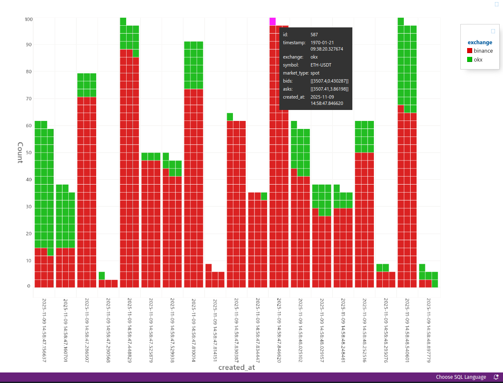
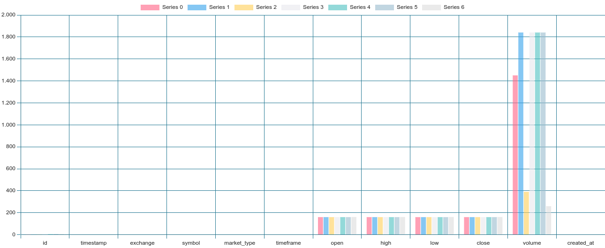
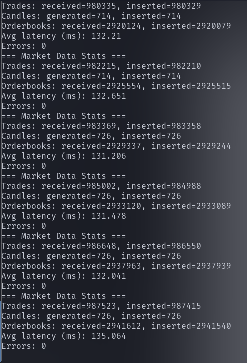

# BTQuant BigBrainCentral Handbook  
### A data spine built to compete with institutions

BTQuant has evolved from “a Backtrader setup with some live feeds” into a market‑data mesh modeled after institutional stacks: hot-path ingestion in C++, SQL Server as the canonical source of truth, and adapters that let research, forward tests, and live strategies consume exactly the same data. This handbook documents what exists today, why it is fundamentally different from retail frameworks, and which capabilities most people have yet to explore.

---

## 1. Core Idea: A Real Market Data Spine

Most toolkits are piles of scripts and CSV files. BTQuant revolves around a spine:

- **C++/ccapi collectors** talk directly to exchange WebSockets, parse trades and orderbook depth, and aggregate klines.
- **`MSSQLBulkInserter`** streams trades, orderbooks, and candles into Microsoft SQL Server via bulk ODBC operations—no Python DB drivers on the hot path.
- **SQL Server** is the canonical truth set. Every consumer—research, forward tests, live trading—reads from the same schema.
- **Backtrader BigBrainCentral adapters** expose those tables back into the strategy engine as standard feeds.

No CSV exports. No “we’ll refactor the data layer later.” Data flows continuously from exchanges into SQL Server and back into strategies and analytics.

---

## 2. Architecture Overview

### 2.1 C++ / ccapi Ingestion Layer

- `ExchangeConnectionManager` wires ccapi `SessionOptions`, `SessionConfigs`, and `Session` together, subscribing to multiple exchanges/symbols/channels in one place. Correlation IDs encode `exchange:symbol:market_type`.
- ccapi manages its own thread pool; BTQuant doesn’t burn Python threads on WebSockets.
- Result: dozens of trade and depth streams with none of the GIL / GC overhead.

### 2.2 MarketDataProcessor: Microstructure on the Hot Path

- Parses ccapi events for trade (`MARKET_DATA_EVENTS_TRADE`) and depth (`MARKET_DATA_EVENTS_MARKET_DEPTH`) streams.
- Uses `safeParseDouble` plus multi-key lookups to normalize heterogeneous payloads.
- Decodes correlation IDs back into exchange / symbol / market_type so every tick is fully classified.
- Enriches trades with side, aggressor flag (`is_buyer_maker`), and microsecond timestamps.
- Serializes orderbook snapshots as compact JSON arrays (bid/ask price & size) ready for microstructure analytics.

All of this happens in C++, keeping allocations minimal.

### 2.3 CandleAggregator: Accurate Multi-Timeframe OHLCV

- Maintains per `exchange:symbol:timeframe` state.
- Supports arbitrary resolutions in seconds/minutes/hours/days (1s, 15s, 1m, 5m, 1h, …).
- Aligns timestamps to bucket boundaries and flushes completed candles for bulk insertion; can dump all active candles on shutdown.
- Candles are built at ingestion time with microsecond precision—no lossy resampling later.

### 2.4 MSSQLBulkInserter: High-Throughput, Low-Latency Storage

- Raw ODBC handles (ENV/DBC/STMT) with prepared statements and column-wise parameter binding.
- Three bulk paths:
  - Trades → `[dbo].[trades]`
  - Orderbook snapshots → `[dbo].[orderbook_snapshots]`
  - OHLCV → dynamic `[dbo].[<symbol>_klines]`
- Ensures tables + indexes exist on first use (idempotent DDL).
- Binds timestamps as `DATETIME2(6)` strings, preserving microseconds end-to-end.

### 2.5 MarketDataCollector: Orchestration and Live Stats

Owns the `MSSQLBulkInserter`, `CandleAggregator`, `MarketDataProcessor`, and `ExchangeConnectionManager`.

- Starts subscriptions, then runs:
  - **Flush loop** – periodically drains buffers into SQL Server.
  - **Stats loop** – prints ingestion metrics (trades/orderbooks inserted, latency, error count).
- On shutdown it flushes buffers, flushes active candles, and bulk-inserts everything grouped per table.
- Those “Trades received 6000 / inserted 5900, Orderbooks 15k / 15k, Errors 0, latency 130 ms” logs come straight from here.

### 2.6 Python Side: SQL Server Feeds

#### MarketDataStorage (JackRabbitRelay / services)

- Wraps the C++ `fast_mssql` driver for synchronous access.
- Manages canonical `[dbo].[trades]` / `[dbo].[orderbook_snapshots]` plus per-pair OHLCV tables (e.g., `binance_btcusdt_klines`).
- Exposes `store_*` and `bulk_store_ohlcv` helpers for other Python services.

#### ReadOnlyOHLCV + DatabaseOHLCVData

- `ReadOnlyOHLCV` is a SELECT-only wrapper—no DDL, no inserts, just fast reads.
  - `mode="global"` – one shared OHLCV table with exchange/symbol/timeframe columns.
  - `mode="per_pair"` – table per market, e.g., `{exchange}_{symbol}_klines`.
- `DatabaseOHLCVData` inherits `bt.feeds.DataBase`, bulk-loads history, polls SQL Server for fresh candles, and converts timestamps via `date2num`.
- Example: `bigbraintest.py` wires `BinanceDBData` into Backtrader to trade live 1-second BTCUSDT candles pulled straight from `BTQ_MarketData`.

This ties the C++ ingestion spine directly into Backtrader—no CSV detours.

---

## 3. What Makes BTQuant Unique

### 3.1 Single Canonical Truth

Other stacks scatter data: historical CSVs, live in-memory buffers, analytics in random formats. BTQuant pushes everything into one SQL Server schema and reads from it everywhere—backtests, forward tests, live trading, notebooks, dashboards. What the strategy sees in backtests matches live semantics.

### 3.2 Microstructure-Grade Data from Day One

- Trades with microsecond timestamps, side, aggressor flag, normalized `exchange/symbol/market_type`.
- Orderbook snapshots with BBO price/size serialized into JSON.
- Candles aggregated from ticks on the ingestion side.

Unlocks orderflow imbalance, queue positioning, spread regime detection, microburst analysis, and true latency profiling—things 1m OHLCV users can only dream about.

### 3.3 Research / Live Parity by Design

Strategies backtest on the same dataset that powers live execution. Differences boil down to how far back you query and whether orders are simulated or routed. Data semantics remain identical.

### 3.4 C++ Hot Path, Python Orchestration

WebSockets, JSON parsing, and DB inserts stay in C++; Python handles orchestration, strategies, analytics, and services. That’s why the collector logs ~270k trades + ~800k orderbooks with ~140 ms average latency and zero insertion errors—without melting CPUs.

### 3.5 SQL Server Used Properly

- `DATETIME2(6)` everywhere—microseconds preserved.
- Per-market OHLCV tables with unique keys and indexes.
- Shared trades/orderbook tables optimized for lookups.
- SandDance / dashboards can connect directly for QA.

### 3.6 Multi-Exchange, Multi-Market from the Start

Correlation IDs and schemas pivot on `(exchange, symbol, market_type)`. Onboarding OKX, Bitget, Bybit, perps, or options is just mapping ccapi payloads into the same normalized structures.

---

## 4. What Other Tools Usually Lack

- **No spine** – CSV/Parquet folders with no schema, no validation, no sharing.
- **No microstructure** – only OHLCV (usually 1m), so execution research is fantasy.
- **Python everywhere** – WebSockets, JSON, DB writes all under the GIL.
- **Split research/live stacks** – offline backtests vs. online broker feeds, meaning mismatched timestamps, symbols, liquidity.
- **Weak QA** – no single view to verify what’s actually stored.

BigBrainCentral is the direct answer to each of these.

---

## 5. Capabilities Most People Haven’t Realized Yet

- **Tick-perfect replay across venues** – synchronize Binance + OKX orderflow at microsecond precision for basis / latency-arb research.
- **Execution research at institutional granularity** – model fills using real depth/trade flows (TWAP, POV, liquidity-taking variants).
- **Regime-aware alphas** – segment by microburst intensity, spread regime, imbalance, and build context-specific signals.
- **Forensic live validation** – replay exact market states from SQL Server into Backtrader to debug “weird” behavior.
- **Unified CEX + DeFi data plane** – study cross-venue liquidity with identical tooling/schemas.
- **Pluggable outputs** – today it’s Backtrader, QuantStats, JackRabbitRelay; tomorrow it can be dashboards, alerting bots, or rust-based risk monitors, all on the same backbone.

This is how you stop “trying strategies” and start real microstructure research.

---

## 6. How to Approach BTQuant as a Power User

1. **Treat SQL Server as the center of gravity.** Inspect `dbo.trades` and `dbo.orderbook_snapshots`, validate timestamps/symbols before writing a single strategy.
2. **Use the Backtrader feeds as the canonical interface.** `DatabaseOHLCVData`, `BinanceDBData`, and custom feed subclasses should be your default inputs.
3. **Start simple but honest.** Build strategies that read directly from the warehouse, add slippage/execution models that respect tick/LOB realities.
4. **Layer complexity deliberately.** Once the data plane is trusted, move to multi-venue research, then ML or RL on microstructure features.

---

## 7. Summary

BigBrainCentral is not a cosmetic upgrade. It’s a structural shift:

- **Ingestion in C++** rather than Python.
- **SQL Server** as a microsecond-aware data warehouse.
- **Backtrader and services** consuming from that warehouse as the single source of truth.

While other frameworks juggle CSVs and “good enough” candles, BTQuant built the institutional foundations: a data spine, a microstructure-ready warehouse, and a unified research/live plane. Everything else—strategies, ML, dashboards—is simply a consumer of that spine. This is the platform for serious work, and it’s still only getting started.

---

## Appendix: Visual QA With SandDance

SQL Server’s canonical schema pairs nicely with Microsoft’s **SandDance** or any Vega/Vega-Lite explorer. Connect the `dbo.trades` and `dbo.orderbook_snapshots` tables through the built‑in SQL Server connector and you can immediately build:

- **Heatmap grids** where each tile represents a trade, colored by size buckets (<0.00005 BTC → deep red, ≥0.04 BTC → dark green). Hover tooltips expose the exact row (timestamp, exchange, symbol, price, aggressor flag) so ingestion anomalies become obvious.
- **3‑D histograms** stacked by exchange or timeframe to inspect message bursts and missing periods visually. Sorting by `id` or `created_at` makes micro-bursts stand out.

These visualizations are not ornamental; they are a QA layer over the market data spine. Because every tick is already in SQL Server, there is zero ETL—just point SandDance (or PowerBI, Grafana, etc.) at the tables and interrogate live ingestion quality in seconds.

### Example Visuals

### System Load Snapshot

Even on a development workstation that is already overloaded with debugging tasks, the collector leaves sixteen logical cores ~97‑98 % idle. The `atop` capture below shows how little CPU the ccapi ingest + MSSQL bulk pipeline actually requires.

## CPU load during ingestion

## MsSQL latency during debugging

