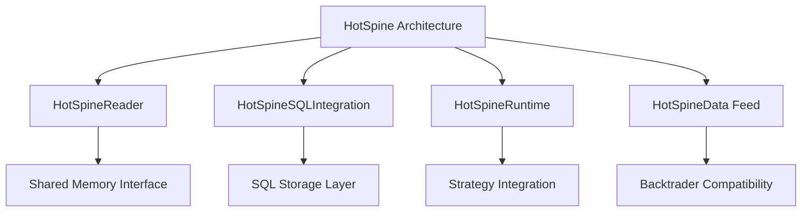
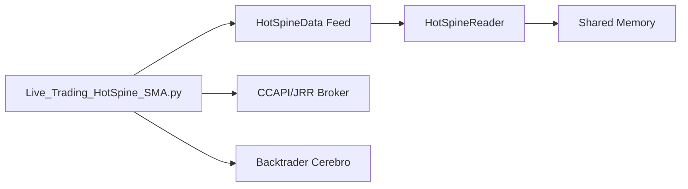
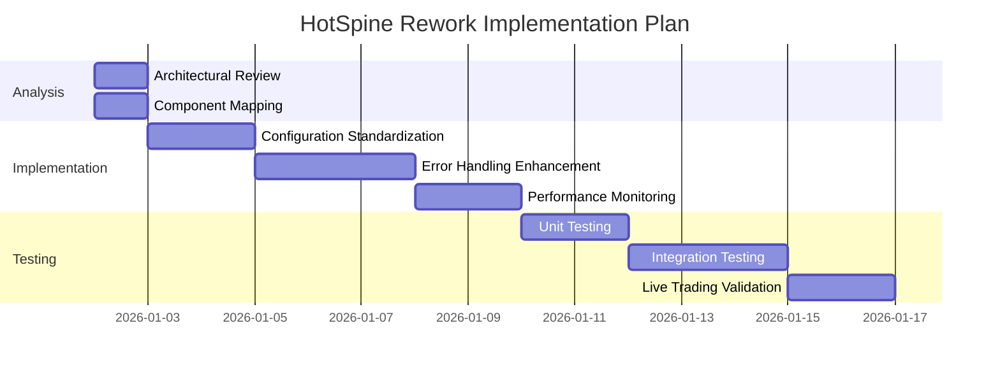

# Comprehensive Architectural Analysis

## 1. Backtest_MsSQL.py Pipeline Analysis

### Core Pipeline Stages and Dependencies

```mermaid
graph TD
    A[Backtest_MsSQL.py] --> B[backtrader.utils.backtest.backtest]
    B --> C[STrend_RSX_AccumulativeSwingIndex Strategy]
    C --> D[Data Ingestion: MsSQL]
    C --> E[Execution: Backtrader Cerebro]
    C --> F[Analysis: QuantStats (optional)]
```

### Data Flow Architecture

1. **Data Ingestion**: MsSQL database connection through `backtest()` utility
2. **Strategy Execution**: `STrend_RSX_AccumulativeSwingIndex` processes historical data
3. **Result Analysis**: Optional QuantStats integration for performance metrics
4. **Error Handling**: Basic try-catch with traceback logging

### Key Characteristics

- **Monolithic Structure**: Single entry point with linear execution flow
- **Synchronous Processing**: Sequential data processing without parallelism
- **Limited Error Recovery**: Basic exception handling without retry logic
- **No Real-time Capabilities**: Designed for historical backtesting only

## 2. HotSpine Current Architecture Analysis

### Core Components and Interactions



### Data Flow and Processing

1. **Real-time Data Ingestion**: Shared memory polling via `HotSpineReader`
2. **Strategy Execution**: `HotSpineRuntime` processes trades through strategy
3. **Asynchronous Storage**: `HotSpineSQLIntegration` handles long-term persistence
4. **Backtrader Integration**: `HotSpineData` feed bridges shared memory to Backtrader

### Key Architectural Features

- **Decoupled Components**: Clear separation between live data and storage
- **Asynchronous Processing**: Non-blocking SQL storage for performance
- **Dual Mode Operation**: Single trade (low latency) vs batch (high throughput)
- **Error Resilience**: Queue-based storage with overflow handling

## 3. Architectural Parallels and Divergences

### Parallels

| Aspect | Backtest_MsSQL.py | HotSpine Architecture |
|--------|-------------------|----------------------|
| Strategy Pattern | Uses backtrader strategies | Uses backtrader strategies |
| Data Processing | Sequential processing | Sequential processing |
| Error Handling | Basic exception handling | Enhanced error handling |
| Integration | Backtrader ecosystem | Backtrader ecosystem |

### Divergences

| Aspect | Backtest_MsSQL.py | HotSpine Architecture |
|--------|-------------------|----------------------|
| Data Source | Historical MsSQL | Real-time shared memory |
| Processing Mode | Synchronous only | Dual mode (single/batch) |
| Storage | Direct database | Asynchronous queue |
| Latency | High (database I/O) | Ultra-low (shared memory) |
| Scalability | Limited by DB | High throughput |

## 4. Performance and Optimization Analysis

### Backtest_MsSQL.py Bottlenecks

- **Database I/O**: Sequential reads from MsSQL
- **Single-threaded**: No parallel processing
- **Memory Usage**: Loads entire dataset into memory
- **No Caching**: Repeated data access without optimization

### HotSpine Performance Advantages

- **Shared Memory**: Sub-microsecond latency access
- **Asynchronous Storage**: Non-blocking SQL operations
- **Batch Processing**: High throughput mode available
- **Memory Efficiency**: Streaming data processing

## 5. Integration Points and Requirements

### Current Integration Status



### Integration Requirements for Flawless Operation

1. **Shared Memory Availability**: HotSpine writer must be running
2. **Library Dependencies**: HotSpine reader library accessible
3. **Broker Configuration**: CCAPI/JRR properly configured
4. **Symbol Mapping**: Consistent symbol_id usage
5. **Error Handling**: Robust connection management

## 6. Rework Plan for HotSpine Architecture Alignment

### Required Changes

1. **Unified Configuration**: Standardize parameter handling
2. **Enhanced Error Recovery**: Automatic reconnection logic
3. **Performance Monitoring**: Real-time metrics collection
4. **Symbol Management**: Dynamic symbol mapping system
5. **Testing Framework**: Comprehensive integration tests

### Implementation Strategy



## 7. Expected Outcomes

### Post-Rework Architecture Benefits

- **Seamless Integration**: Live_Trading_HotSpine_SMA.py runs flawlessly
- **Improved Reliability**: Robust error handling and recovery
- **Enhanced Performance**: Optimized data flow and processing
- **Better Monitoring**: Real-time metrics and diagnostics
- **Future-Proof**: Scalable architecture for new features

## 8. Recommendations

1. **Implement Configuration Management**: Centralized parameter handling
2. **Enhance Error Recovery**: Automatic reconnection and retry logic
3. **Add Performance Metrics**: Real-time monitoring dashboard
4. **Standardize Symbol Mapping**: Consistent symbol_id management
5. **Comprehensive Testing**: Unit, integration, and end-to-end tests