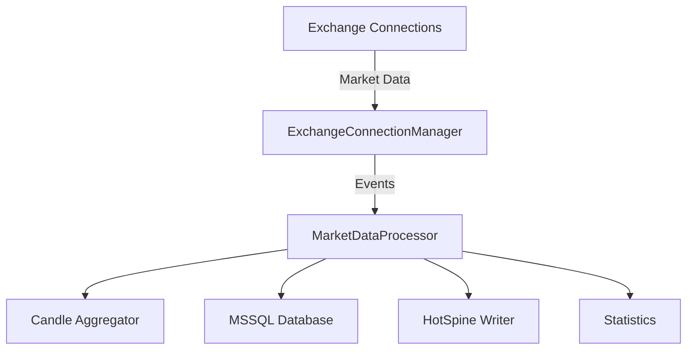

# CCAPI Data Collector Troubleshooting Guide

## Architecture Overview

The CCAPI data collector follows this data flow:



## Root Cause Analysis for Complete Inactivity

When all metrics (trades, candles, orderbooks, latency, errors) are consistently zero, the issue typically lies in one of these critical failure points:

### 1. Configuration Issues

#### Database Configuration
- **Problem**: Invalid or unreachable database connection
- **Symptoms**: No data insertion, but no explicit errors
- **Checks**:
  - Verify `db_connection_string` in config.json
  - Test database connectivity manually
  - Check if MS SQL Server is running and accessible
  - Validate credentials in `config.json`

#### Exchange Configuration
- **Problem**: Incorrect exchange settings or unsupported symbols
- **Symptoms**: No subscriptions established, no data received
- **Checks**:
  - Verify exchange names are correct (e.g., "binance", not "Binance")
  - Check symbol formats match exchange requirements (e.g., "BTC-USDT" vs "BTC/USDT")
  - Validate market types ("spot", "perpetual", etc.)
  - Ensure channels are supported ("TRADE", "MARKET_DEPTH")

### 2. Connectivity Problems

#### Network Connectivity
- **Problem**: Network issues preventing exchange connections
- **Symptoms**: No subscription acknowledgments, silent failures
- **Checks**:
  - Test network connectivity to exchange APIs
  - Check firewall/proxy settings
  - Verify DNS resolution for exchange endpoints
  - Test with `curl` or `wget` to exchange REST endpoints

#### Exchange API Issues
- **Problem**: Exchange API downtime or rate limiting
- **Symptoms**: No data flow despite successful subscriptions
- **Checks**:
  - Check exchange status pages
  - Monitor for API rate limit responses
  - Test with different exchanges to isolate issues

### 3. CCAPI Session Problems

#### Session Initialization
- **Problem**: CCAPI session fails to initialize properly
- **Symptoms**: No subscription attempts, immediate shutdown
- **Checks**:
  - Verify CCAPI library is properly built and linked
  - Check for missing dependencies
  - Review CCAPI logs for initialization errors

#### Subscription Failures
- **Problem**: Subscriptions not being processed by CCAPI
- **Symptoms**: No subscription status messages, no data events
- **Checks**:
  - Enable CCAPI debug logging
  - Verify subscription requests are sent
  - Check for subscription error responses
  - Review correlation IDs in logs

### 4. Data Processing Pipeline Issues

#### Event Handling
- **Problem**: Events not being processed by MarketDataProcessor
- **Symptoms**: Zero metrics across all categories
- **Checks**:
  - Verify `processEvent()` is being called
  - Check for exceptions in event processing
  - Review event type filtering logic

#### Buffer Management
- **Problem**: Data buffers not being flushed
- **Symptoms**: Data collected but not inserted
- **Checks**:
  - Verify flush intervals and buffer size limits
  - Check if flush threads are running
  - Review buffer statistics

### 5. Error Handling and Logging

#### Silent Failures
- **Problem**: Errors occurring but not being reported
- **Symptoms**: Zero metrics with no visible errors
- **Checks**:
  - Enable verbose logging in all components
  - Check for swallowed exceptions
  - Review error counters and logging statements

## Structured Troubleshooting Approach

### Step 1: Verify Basic Connectivity

1. **Test database connectivity**:
   ```bash
   # Test MS SQL connection
   sqlcmd -S localhost -U sa -P your_password -d market_data -Q "SELECT 1"
   ```

2. **Test exchange API connectivity**:
   ```bash
   # Test Binance API
   curl https://api.binance.com/api/v3/ping
   ```

### Step 2: Validate Configuration

1. **Check config.json**:
   ```json
   {
     "db": {
       "server": "localhost",
       "database": "market_data",
       "user": "sa",
       "password": "your_password"
     },
     "exchanges": [
       {
         "name": "binance",
         "symbols": ["BTC-USDT", "ETH-USDT"],
         "channels": ["TRADE", "MARKET_DEPTH"],
         "market_type": "spot"
       }
     ]
   }
   ```

2. **Verify symbol formats** match exchange requirements

### Step 3: Enable Debug Logging

1. **Modify CCAPI logger settings** to enable debug output
2. **Add logging** to key points in the data flow:
   - Subscription creation
   - Event processing
   - Data insertion

### Step 4: Test Individual Components

1. **Test CCAPI session independently**:
   ```cpp
   // Create minimal test for CCAPI subscription
   ccapi::SessionOptions options;
   ccapi::SessionConfigs configs;
   ccapi::Session session(options, configs, nullptr);
   
   std::vector<ccapi::Subscription> subs;
   subs.push_back(ccapi::Subscription("binance", "BTC-USDT", "TRADE", "", "test"));
   session.subscribe(subs);
   ```

2. **Test database insertion manually**:
   ```cpp
   // Test MSSQLBulkInserter with sample data
   MSSQLBulkInserter db(connection_string);
   std::vector<MarketData::Trade> test_trades;
   // Add test trade data
   db.bulkInsertTrades(test_trades);
   ```

### Step 5: Monitor Runtime Behavior

1. **Check process status**:
   ```bash
   # Check if collector process is running
   ps aux | grep market_data_collector
   ```

2. **Monitor resource usage**:
   ```bash
   # Check CPU, memory, network usage
   top -p <pid>
   iftop
   ```

3. **Review statistics output**:
   ```
   # Expected output format:
   === Market Data Stats ===
   Trades: received=0, inserted=0, rate=0 /s
   Candles: generated=0, inserted=0
   Orderbooks: received=0, inserted=0, rate=0 /s
   Avg latency (ms): 0
   Errors: 0
   ```

## Common Resolution Strategies

### 1. Database Connection Issues
- **Solution**: Update connection string with correct credentials
- **Verification**: Test connection manually before running collector

### 2. Exchange Configuration Problems
- **Solution**: Use exact symbol formats required by each exchange
- **Verification**: Check exchange API documentation for symbol formats

### 3. Network/Proxy Restrictions
- **Solution**: Configure proxy settings or whitelist exchange endpoints
- **Verification**: Test connectivity from the same network

### 4. CCAPI Library Problems
- **Solution**: Rebuild CCAPI with debug symbols and logging
- **Verification**: Test CCAPI with simple subscription example

### 5. Resource Constraints
- **Solution**: Increase buffer sizes and flush intervals
- **Verification**: Monitor memory usage during operation

## Prevention and Monitoring

### Proactive Measures
1. **Implement health checks** for all components
2. **Add comprehensive logging** at all critical points
3. **Set up monitoring** for key metrics
4. **Create automated tests** for configuration validation

### Monitoring Recommendations
1. **Track subscription status** and reconnection attempts
2. **Monitor data flow rates** at each pipeline stage
3. **Alert on error rate increases** or data flow interruptions
4. **Log configuration changes** for audit trail

## Conclusion

The most likely root causes for complete inactivity are:

1. **Configuration errors** (invalid database credentials or exchange settings)
2. **Connectivity issues** (network problems or exchange API downtime)
3. **CCAPI session failures** (library initialization or subscription problems)

The structured approach involves:
1. Verifying basic connectivity
2. Validating configuration
3. Enabling debug logging
4. Testing individual components
5. Monitoring runtime behavior

By systematically checking each potential failure point and implementing proper monitoring, the root cause can be identified and resolved efficiently.