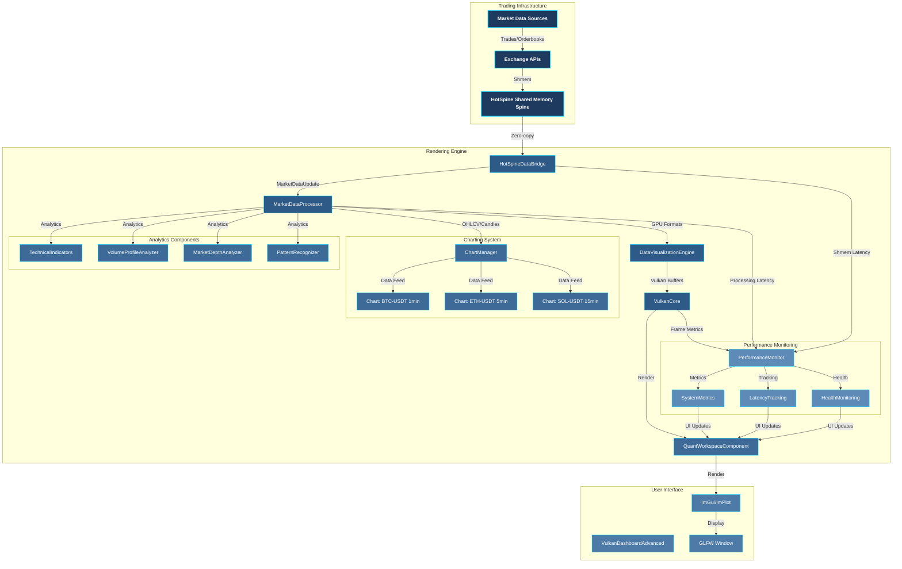

# Dashboard Architecture Diagram

```mermaid
graph TD
    %% System Architecture
    subgraph "Trading Infrastructure"
        MarketData[Market Data Sources]
        Exchange[Exchange APIs]
        HotSpine[HotSpine Shared Memory Spine]
    end

    subgraph "Rendering Engine"
        DataBridge[HotSpineDataBridge]
        DataProcessor[MarketDataProcessor]
        VisualizationEngine[DataVisualizationEngine]
        VulkanCore[VulkanCore]
        QuantWorkspace[QuantWorkspaceComponent]
        
        subgraph "Charting System"
            ChartManager[ChartManager]
            Chart1[Chart: BTC-USDT 1min]
            Chart2[Chart: ETH-USDT 5min]
            Chart3[Chart: SOL-USDT 15min]
        end
        
        subgraph "Analytics Components"
            TechnicalIndicators[TechnicalIndicators]
            VolumeProfile[VolumeProfileAnalyzer]
            MarketDepth[MarketDepthAnalyzer]
            PatternRecognizer[PatternRecognizer]
        end
        
        subgraph "Performance Monitoring"
            PerformanceMonitor[PerformanceMonitor]
            SystemMetrics[SystemMetrics]
            LatencyTracking[LatencyTracking]
            HealthMonitoring[HealthMonitoring]
        end
    end

    subgraph "User Interface"
        VulkanDashboard[VulkanDashboardAdvanced]
        ImGui[ImGui/ImPlot]
        Window[GLFW Window]
    end

    %% Data Flow
    MarketData -->|Trades/Orderbooks| Exchange
    Exchange -->|Shmem| HotSpine
    
    HotSpine -->|Zero-copy| DataBridge
    DataBridge -->|MarketDataUpdate| DataProcessor
    DataProcessor -->|Analytics| TechnicalIndicators
    DataProcessor -->|Analytics| VolumeProfile
    DataProcessor -->|Analytics| MarketDepth
    DataProcessor -->|Analytics| PatternRecognizer
    
    DataProcessor -->|OHLCV/Candles| ChartManager
    ChartManager -->|Data Feed| Chart1
    ChartManager -->|Data Feed| Chart2
    ChartManager -->|Data Feed| Chart3
    
    DataProcessor -->|GPU Formats| VisualizationEngine
    VisualizationEngine -->|Vulkan Buffers| VulkanCore
    VulkanCore -->|Render| QuantWorkspace
    
    QuantWorkspace -->|Render| ImGui
    ImGui -->|Display| Window
    
    %% Performance Monitoring
    VulkanCore -->|Frame Metrics| PerformanceMonitor
    DataProcessor -->|Processing Latency| PerformanceMonitor
    DataBridge -->|Shmem Latency| PerformanceMonitor
    PerformanceMonitor -->|Metrics| SystemMetrics
    PerformanceMonitor -->|Tracking| LatencyTracking
    PerformanceMonitor -->|Health| HealthMonitoring
    
    SystemMetrics -->|UI Updates| QuantWorkspace
    LatencyTracking -->|UI Updates| QuantWorkspace
    HealthMonitoring -->|UI Updates| QuantWorkspace

    %% Styling
    classDef system fill:#1e3a5f,stroke:#00d4ff,stroke-width:2px,color:#ffffff,font-weight:bold
    classDef engine fill:#2d5a86,stroke:#00d4ff,stroke-width:1px,color:#ffffff
    classDef component fill:#3d6a96,stroke:#00d4ff,stroke-width:1px,color:#ffffff
    classDef ui fill:#4d7aa6,stroke:#00d4ff,stroke-width:1px,color:#ffffff
    classDef monitoring fill:#5d8ab6,stroke:#00d4ff,stroke-width:1px,color:#ffffff

    class MarketData,Exchange,HotSpine system
    class DataBridge,DataProcessor,VisualizationEngine,VulkanCore engine
    class QuantWorkspace,ChartManager,Chart1,Chart2,Chart3,TechnicalIndicators,VolumeProfile,MarketDepth,PatternRecognizer component
    class VulkanDashboard,ImGui,Window ui
    class PerformanceMonitor,SystemMetrics,LatencyTracking,HealthMonitoring monitoring
```
