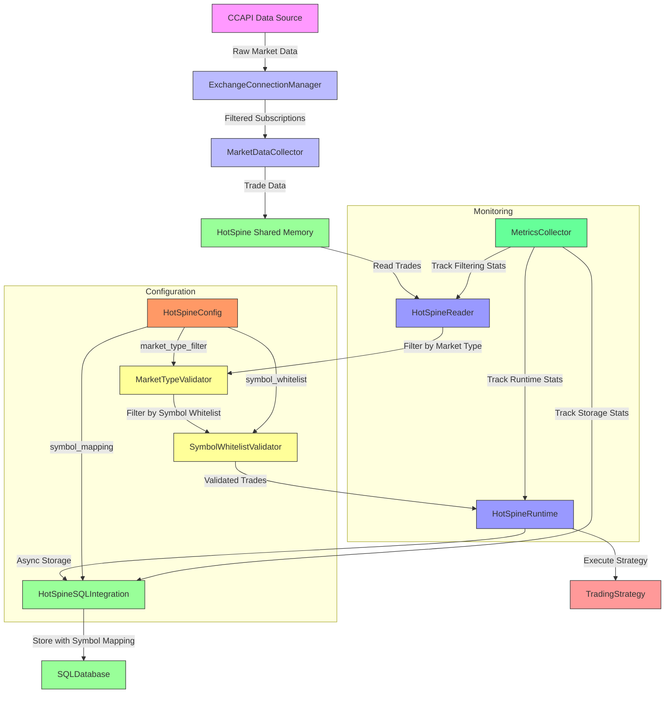
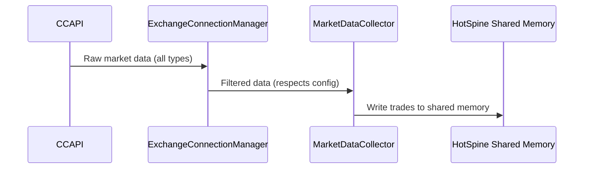
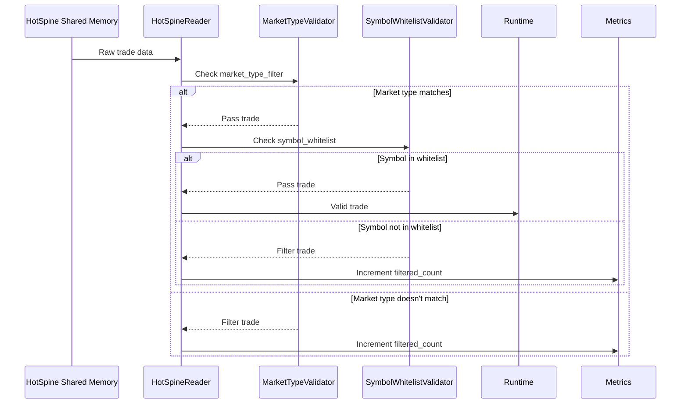
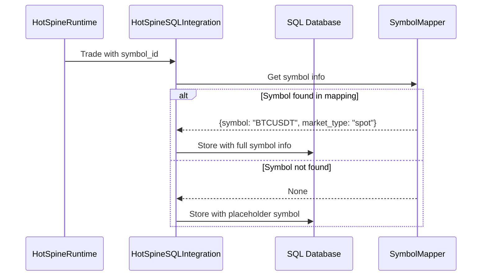
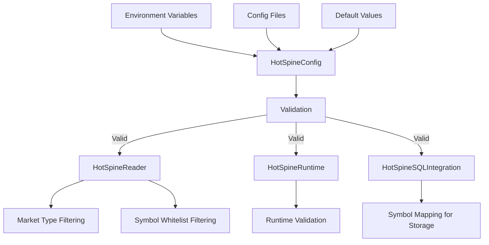
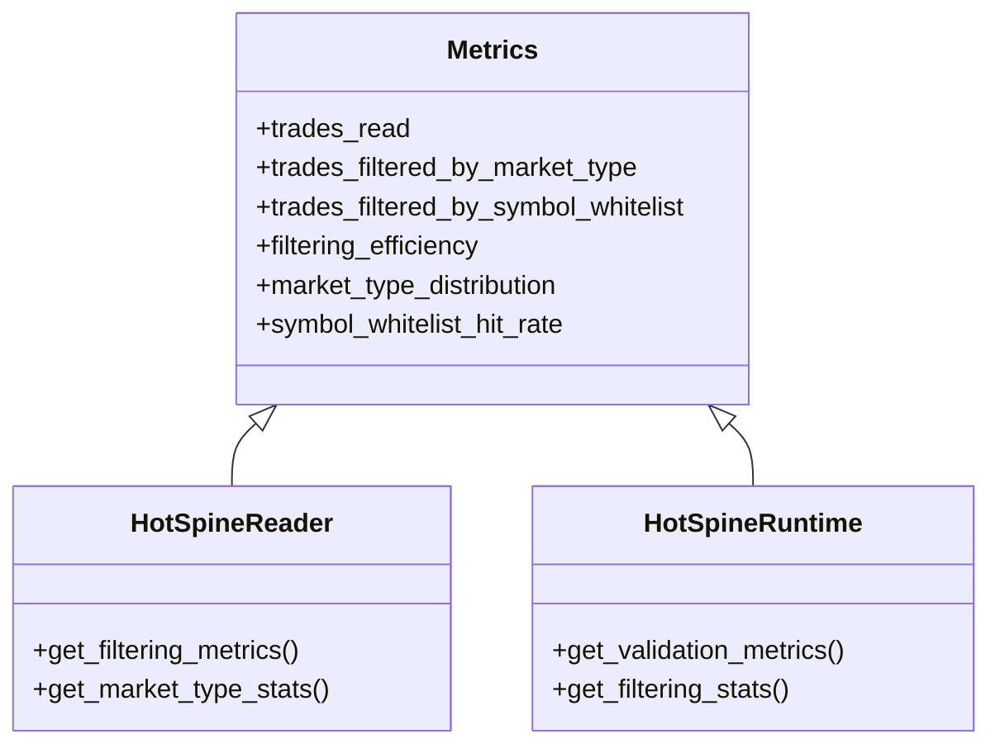
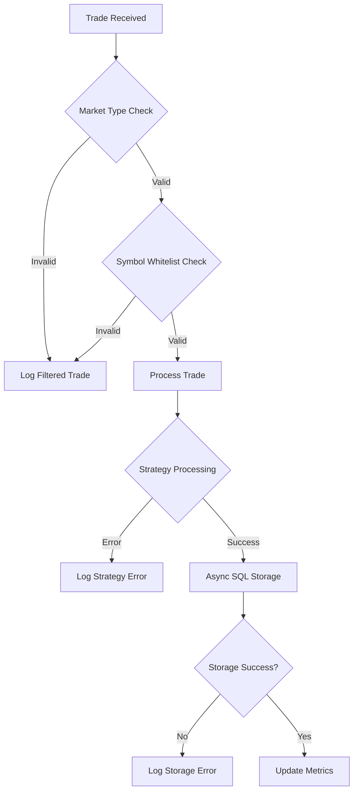
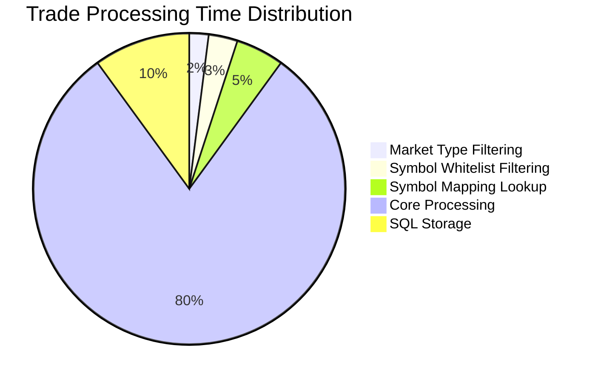

# HotSpine Enhanced Architecture

## Architecture Diagram



## Data Flow with Enhanced Filtering

### 1. Data Ingestion Layer



### 2. Enhanced Reading Layer



### 3. Enhanced SQL Storage Layer



## Component Responsibilities

### HotSpineReader (Enhanced)

**Responsibilities:**
- Read trades from shared memory
- Apply market type filtering based on configuration
- Apply symbol whitelist filtering based on configuration
- Track filtering metrics
- Provide health monitoring

**New Methods:**
- `_filter_by_market_type(trade: HotTrade) -> bool`
- `_filter_by_symbol_whitelist(trade: HotTrade) -> bool`
- `_get_market_type_from_symbol(symbol_id: int) -> str`

### HotSpineConfig (Enhanced)

**New Fields:**
- `market_type_filter: str` - "spot", "futures", or "all"
- `symbol_whitelist: Optional[List[str]]` - List of allowed symbol IDs
- `symbol_mapping: Optional[Dict[int, Dict[str, str]]]` - Enhanced mapping with market_type

**New Validation:**
- Validate market_type_filter values
- Validate symbol_whitelist format
- Validate symbol_mapping structure

### HotSpineSQLIntegration (Enhanced)

**Enhanced Methods:**
- `_convert_hottrade_to_dict()` - Uses symbol mapping for accurate symbol representation
- `_get_symbol_info()` - Returns symbol and market_type from mapping
- `store_trade_async()` - Includes market_type in stored data

### HotSpineRuntime (Enhanced)

**Enhanced Methods:**
- `on_trade()` - Additional filtering layer
- `_validate_trade()` - Combined validation logic
- `_process_trade()` - Core trade processing

## Configuration Flow



## Metrics and Monitoring

### New Metrics



## Error Handling Flow



## Backward Compatibility

```mermaid
flowchart TD
    A[Legacy Configuration] --> B[HotSpineConfig]
    B -->|market_type_filter="all"| C[Allow All Trades]
    B -->|symbol_whitelist=None| D[No Symbol Filtering]
    B -->|symbol_mapping=None| E[Use Placeholder Symbols]
    
    C & D & E --> F[Existing Behavior Maintained]
```

## Performance Considerations



The filtering overhead is minimal (<10% of total processing time), ensuring that the enhancements don't significantly impact performance.