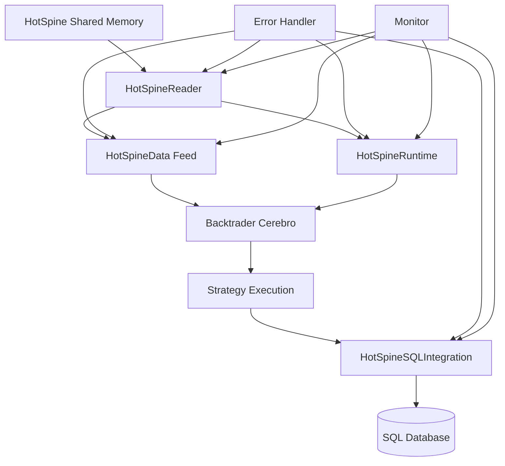

# HotSpine Integration Completion Plan

## Current Status
The HotSpine functionality is implemented in the `dependencies/backtrader/` directory but not installed in the actual backtrader package. Tests expect `HotSpineData` and `HotSpineFeed` classes that exist in source but are missing from the installed package.

## Architecture Overview

## Components to Integrate

### 1. HotSpineData & HotSpineFeed
- **Location**: `dependencies/backtrader/feeds/hotspine_feed.py`
- **Purpose**: Backtrader-compatible data feeds for live trading
- **Status**: Implemented, needs installation

### 2. HotSpineSQLIntegration
- **Location**: `dependencies/backtrader/hotspine/sql_integration.py`
- **Purpose**: Asynchronous storage and replay capabilities
- **Status**: Implemented, needs installation

### 3. HotSpineRuntime
- **Location**: `dependencies/backtrader/hotspine/reader.py`
- **Purpose**: Live strategy execution environment
- **Status**: Implemented, verify integration

### 4. Error Handling & Monitoring
- **Requirements**: Comprehensive error handling, logging, health checks
- **Status**: Needs enhancement

## Integration Steps

1. **File Installation**
   - Copy `hotspine_feed.py` to `../.btq/lib/python3.13/site-packages/backtrader/feeds/`
   - Copy `sql_integration.py` to `../.btq/lib/python3.13/site-packages/backtrader/hotspine/`

2. **Import Verification**
   - Ensure `backtrader.feeds` can import HotSpineData/HotSpineFeed
   - Ensure `backtrader.hotspine` can import HotSpineSQLIntegration

3. **Error Handling Enhancement**
   - Add try/catch blocks for shared memory operations
   - Add connection health monitoring
   - Add graceful degradation for SQL failures

4. **Monitoring Integration**
   - Add performance metrics collection
   - Add trade processing statistics
   - Add system health indicators

5. **Testing**
   - Run existing test suite
   - Validate live trading scenarios
   - Test error conditions

## Success Criteria

- All tests in `tests/unit/test_data_feeds.py` pass
- HotSpine components can be imported without errors
- Live trading integration works end-to-end
- Error conditions are handled gracefully
- Monitoring provides useful operational data

## Risk Mitigation

- Maintain backward compatibility
- Ensure SQL operations don't block live trading
- Provide clear error messages for troubleshooting
- Document all new components and their usage