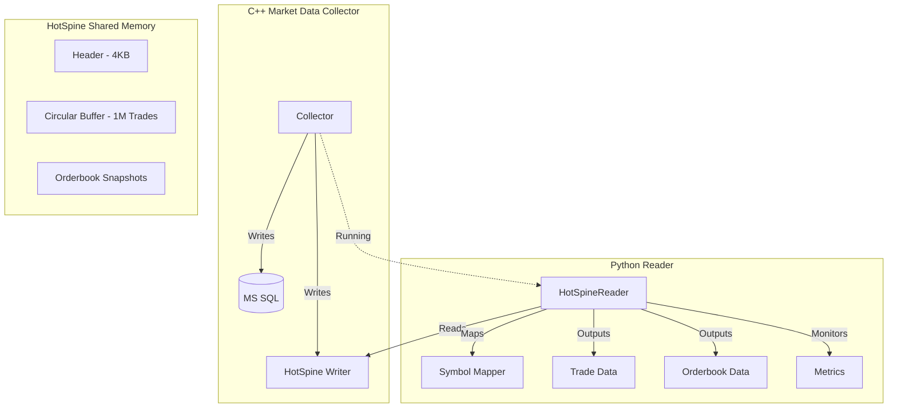

# HotSpine Python Reader Implementation Plan

## Executive Summary
Create a comprehensive Python reader for the HotSpine shared memory architecture that can fully read market data (trades and orderbooks) from RAM while the C++ market data collector is running.

## Architecture Overview



## Data Structures

### HotTrade (from hotspine_layout.hpp)
- `ts_exchange`: uint64 - Exchange timestamp in microseconds
- `ts_local`: uint64 - Local receive timestamp in microseconds
- `price`: double - Trade price
- `size`: double - Trade size
- `symbol_id`: uint32 - Symbol ID (hash or mapping)
- `side`: uint8 - 0=buy, 1=sell

### HotOrderbookSnapshot (from hotspine_layout.hpp)
- `ts_exchange`: uint64 - Exchange timestamp in microseconds
- `ts_local`: uint64 - Local receive timestamp in microseconds
- `symbol_id`: uint32 - Symbol ID
- `bids_count`: uint8 - Number of bid levels
- `asks_count`: uint8 - Number of ask levels
- `bids[20]`: HotOrderbookLevel - Bid levels
- `asks[20]`: HotOrderbookLevel - Ask levels

### SharedMemoryHeader
- `version`: uint64 - Protocol version
- `capacity`: uint64 - Buffer capacity
- `write_index`: uint64 - Writer position
- `read_index`: uint64 - Reader position
- `lost_count`: uint64 - Lost trades due to overflow

## Implementation Tasks

### 1. Core Reader Implementation (`python_market_data_collector/hotspine_reader.py`)

#### HotTrade Python Class
```python
class HotTrade:
    ts_exchange: int  # microseconds
    ts_local: int     # microseconds
    price: float
    size: float
    symbol_id: int
    side: str         # 'buy' or 'sell'
    exchange: str     # resolved from symbol_id
    symbol: str       # resolved from symbol_id
```

#### HotOrderbookSnapshot Python Class
```python
class HotOrderbookSnapshot:
    ts_exchange: int
    ts_local: int
    symbol_id: int
    bids: List[Tuple[float, float]]  # [(price, size), ...]
    asks: List[Tuple[float, float]]  # [(price, size), ...]
    exchange: str
    symbol: str
```

#### HotSpineReader Class Methods
- `poll_trade() -> Optional[HotTrade]`: Poll for single trade (non-blocking)
- `poll_orderbook() -> Optional[HotOrderbookSnapshot]`: Poll for orderbook
- `read_all_trades() -> List[HotTrade]`: Read all available trades
- `read_all_orderbooks() -> List[HotOrderbookSnapshot]`: Read all available orderbooks
- `get_buffer_utilization() -> Dict`: Get current/capacity sizes
- `get_lost_count() -> int`: Get overflow counter
- `is_healthy() -> bool`: Health check
- `get_statistics() -> Dict`: Comprehensive stats

### 2. Symbol Mapping (`python_market_data_collector/symbol_mapper.py`)

```python
class SymbolMapper:
    def __init__(self, mapping_file: Optional[str] = None):
        # Load symbol_id -> (exchange, symbol) mapping
        # Support loading from JSON config
        
    def get_symbol_info(self, symbol_id: int) -> Tuple[str, str]:
        # Resolve symbol_id to (exchange, symbol)
        
    def register_symbol(self, exchange: str, symbol: str) -> int:
        # Register new symbol and get/assign ID
```

### 3. Buffer Monitoring (`python_market_data_collector/buffer_monitor.py`)

```python
class BufferMonitor:
    def __init__(self, reader: HotSpineReader):
        self.reader = reader
        
    def get_utilization(self) -> Dict[str, Any]:
        # current_size, capacity, percentage
        
    def get_rate_stats(self) -> Dict[str, float]:
        # trades_per_sec, orderbooks_per_sec
        
    def get_health_report(self) -> Dict[str, Any]:
        # Comprehensive health status
```

### 4. Real-time Statistics (`python_market_data_collector/hotspine_stats.py`)

```python
class HotSpineStatistics:
    def __init__(self, reader: HotSpineReader):
        self.reader = reader
        
    def start(self):
        # Start statistics collection
        
    def stop(self):
        # Stop and return final report
        
    def get_live_stats(self) -> Dict[str, Any]:
        # Real-time statistics
        
    def print_report(self):
        # Human-readable report
```

### 5. Integration Tests (`tests/integration/test_hotspine_reader.py`)

```python
def test_trade_collection_while_collector_runs():
    # Start C++ collector
    # Start Python reader
    # Verify trades are received
    # Check symbol mapping works
    # Validate buffer utilization

def test_orderbook_collection_while_collector_runs():
    # Start C++ collector
    # Start Python reader
    # Verify orderbooks are received
    # Validate orderbook structure

def test_health_monitoring():
    # Verify health checks
    # Test reconnection logic
    # Validate metrics accuracy

def test_performance_under_load():
    # High-frequency trade testing
    # Buffer overflow handling
    # Latency measurement
```

## Files to Create

1. `python_market_data_collector/hotspine_reader.py` - Core reader implementation
2. `python_market_data_collector/symbol_mapper.py` - Symbol ID mapping
3. `python_market_data_collector/buffer_monitor.py` - Buffer monitoring
4. `python_market_data_collector/hotspine_stats.py` - Statistics collection
5. `tests/integration/test_hotspine_reader.py` - Integration tests
6. `examples/hotspine_reader_example.py` - Usage examples

## Configuration

```json
{
  "hotspine": {
    "shm_name": "/btquant_hotspine",
    "capacity": 1000000,
    "buffer_size": 4096
  },
  "symbol_mapping": {
    "enabled": true,
    "mapping_file": "symbols.json"
  },
  "monitoring": {
    "enabled": true,
    "stats_interval": 1.0,
    "health_check_interval": 5.0
  }
}
```

## Testing Strategy

### Unit Tests
- HotTrade creation and serialization
- HotOrderbookSnapshot creation
- Symbol mapping accuracy
- Buffer utilization calculations

### Integration Tests
- Trade collection while C++ collector runs
- Orderbook collection while C++ collector runs
- Health monitoring and recovery
- Performance under load

### Performance Tests
- Latency measurement (target: <100μs)
- Throughput measurement (target: >100K trades/sec)
- Buffer overflow handling
- Memory usage monitoring

## Success Criteria

1. **Functional Requirements**
   - [ ] Trades can be read from HotSpine while C++ collector runs
   - [ ] Orderbooks can be read from HotSpine while C++ collector runs
   - [ ] Symbol mapping resolves symbol_id to exchange/symbol
   - [ ] Buffer utilization monitoring works correctly
   - [ ] Lost trades are correctly counted

2. **Performance Requirements**
   - [ ] Poll trade latency < 100 microseconds
   - [ ] Batch read throughput > 100K trades/second
   - [ ] Zero data loss under normal operation

3. **Reliability Requirements**
   - [ ] Reader handles collector restarts gracefully
   - [ ] Reader recovers from shared memory disconnection
   - [ ] Health monitoring detects issues within 5 seconds

## Implementation Order

1. Core HotTrade and HotOrderbookSnapshot classes
2. Basic HotSpineReader with ctypes interface
3. SymbolMapper with JSON configuration
4. BufferMonitor for utilization tracking
5. HotSpineStatistics for real-time metrics
6. Integration tests with C++ collector
7. Performance benchmarking
8. Documentation and examples

## Dependencies

- Python 3.8+
- ctypes (standard library)
- json (standard library)
- threading (standard library)
- time (standard library)
- Optional: numpy for performance optimization
