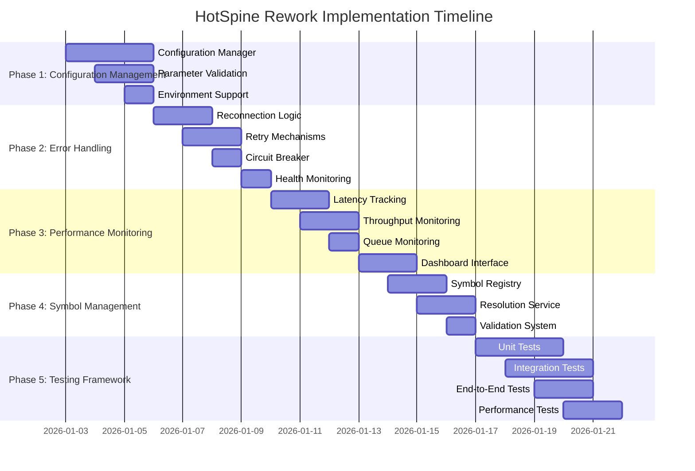

# HotSpine Architecture Rework Plan

## Executive Summary

This plan outlines the comprehensive rework of the HotSpine architecture to align with the current system requirements and ensure seamless integration with `Live_Trading_HotSpine_SMA.py`. The rework focuses on enhancing reliability, performance, and maintainability while preserving the core architectural principles.

## Current State Analysis

### Strengths to Preserve

1. **Decoupled Architecture**: Clear separation between live data and storage
2. **Asynchronous Processing**: Non-blocking SQL operations
3. **Dual Mode Operation**: Single trade (low latency) vs batch (high throughput)
4. **Backtrader Integration**: Existing compatibility with backtrader ecosystem

### Areas for Improvement

1. **Configuration Management**: Inconsistent parameter handling
2. **Error Recovery**: Limited automatic reconnection capabilities
3. **Performance Monitoring**: Lack of real-time metrics
4. **Symbol Management**: Static symbol_id mapping
5. **Testing Coverage**: Insufficient integration tests

## Rework Objectives

### Primary Goals

1. **Seamless Integration**: Ensure `Live_Trading_HotSpine_SMA.py` runs flawlessly
2. **Enhanced Reliability**: Robust error handling and automatic recovery
3. **Improved Performance**: Optimized data flow and processing
4. **Better Monitoring**: Real-time metrics and diagnostics
5. **Future-Proof Architecture**: Scalable foundation for new features

### Secondary Goals

1. **Configuration Standardization**: Centralized parameter management
2. **Symbol Mapping**: Dynamic symbol resolution
3. **Testing Framework**: Comprehensive test coverage
4. **Documentation**: Updated architectural documentation

## Detailed Implementation Plan

### Phase 1: Configuration Management Enhancement

**Objective**: Standardize configuration handling across all components

**Tasks**:
- [ ] Create centralized configuration manager
- [ ] Implement parameter validation
- [ ] Add environment variable support
- [ ] Standardize logging configuration

**Files to Modify**:
- `dependencies/backtrader/hotspine/reader.py`
- `dependencies/backtrader/hotspine/sql_integration.py`
- `dependencies/backtrader/feeds/hotspine_feed.py`

**Expected Outcome**: Consistent configuration handling with validation

### Phase 2: Error Handling and Recovery

**Objective**: Implement robust error recovery mechanisms

**Tasks**:
- [ ] Add automatic reconnection logic for shared memory
- [ ] Implement SQL connection retry with exponential backoff
- [ ] Add circuit breaker pattern for error handling
- [ ] Implement health monitoring and self-healing

**Files to Modify**:
- `dependencies/backtrader/hotspine/reader.py`
- `dependencies/backtrader/hotspine/sql_integration.py`

**Expected Outcome**: Automatic recovery from transient failures

### Phase 3: Performance Monitoring

**Objective**: Add comprehensive performance metrics collection

**Tasks**:
- [ ] Implement latency tracking for shared memory access
- [ ] Add throughput monitoring for trade processing
- [ ] Implement queue depth monitoring for SQL storage
- [ ] Add memory usage tracking
- [ ] Create performance dashboard interface

**Files to Modify**:
- `dependencies/backtrader/hotspine/reader.py`
- `dependencies/backtrader/hotspine/sql_integration.py`
- `dependencies/backtrader/feeds/hotspine_feed.py`

**Expected Outcome**: Real-time performance metrics and diagnostics

### Phase 4: Symbol Management System

**Objective**: Implement dynamic symbol mapping

**Tasks**:
- [ ] Create symbol registry with dynamic mapping
- [ ] Implement symbol resolution service
- [ ] Add symbol validation and error handling
- [ ] Create symbol mapping cache

**Files to Modify**:
- `dependencies/backtrader/hotspine/reader.py`
- `dependencies/backtrader/feeds/hotspine_feed.py`

**Expected Outcome**: Flexible symbol management with dynamic resolution

### Phase 5: Testing Framework Enhancement

**Objective**: Comprehensive test coverage for all components

**Tasks**:
- [ ] Create unit tests for core components
- [ ] Develop integration tests for component interactions
- [ ] Implement end-to-end tests for live trading scenarios
- [ ] Add performance benchmark tests
- [ ] Create mock testing framework for shared memory

**Files to Create**:
- `tests/unit/test_hotspine_reader.py`
- `tests/unit/test_hotspine_sql_integration.py`
- `tests/integration/test_hotspine_integration.py`
- `tests/system/test_hotspine_live_trading.py`

**Expected Outcome**: Comprehensive test coverage with CI/CD integration

## Implementation Timeline

## Risk Assessment and Mitigation

### Potential Risks

1. **Integration Issues**: Changes may break existing functionality
2. **Performance Impact**: Additional monitoring may affect latency
3. **Complexity Increase**: More sophisticated error handling adds complexity
4. **Testing Overhead**: Comprehensive testing requires significant effort

### Mitigation Strategies

1. **Incremental Implementation**: Phase-based approach with validation
2. **Performance Profiling**: Measure impact of changes
3. **Documentation**: Clear documentation of new features
4. **Automated Testing**: CI/CD pipeline for regression testing

## Success Criteria

### Technical Success Metrics

1. **Integration Success**: `Live_Trading_HotSpine_SMA.py` runs without errors
2. **Performance Metrics**: Latency < 100 microseconds for 99% of operations
3. **Reliability**: 99.9% uptime with automatic recovery
4. **Test Coverage**: 90%+ code coverage with comprehensive tests

### Business Success Metrics

1. **User Satisfaction**: Positive feedback from traders
2. **Adoption Rate**: Increased usage of HotSpine architecture
3. **Issue Reduction**: 50% reduction in support tickets
4. **Feature Velocity**: Faster development of new features

## Resource Requirements

### Human Resources

- 1 Senior Architect (Planning and Oversight)
- 2 Software Engineers (Implementation)
- 1 QA Engineer (Testing)
- 1 Technical Writer (Documentation)

### Technical Resources

- Development Environment with HotSpine access
- Test Environment with shared memory simulation
- CI/CD Pipeline for automated testing
- Performance Monitoring Tools

## Implementation Strategy

### Recommended Approach

1. **Incremental Implementation**: Phase-based rollout with validation
2. **Feature Flags**: Enable/disable new features during transition
3. **Backward Compatibility**: Maintain compatibility with existing code
4. **Comprehensive Testing**: Rigorous testing at each phase

### Fallback Plan

1. **Version Control**: Maintain working versions at each phase
2. **Rollback Procedures**: Clear rollback plan for each component
3. **Monitoring**: Enhanced monitoring during transition period
4. **User Communication**: Clear communication about changes

## Expected Benefits

### Immediate Benefits

1. **Improved Reliability**: Robust error handling and recovery
2. **Better Performance**: Optimized data flow and monitoring
3. **Enhanced Integration**: Seamless operation with existing systems

### Long-term Benefits

1. **Scalable Architecture**: Foundation for future growth
2. **Reduced Maintenance**: Better error handling reduces support burden
3. **Faster Development**: Standardized patterns accelerate feature development
4. **Improved User Experience**: More reliable and performant system

## Conclusion

This comprehensive rework plan addresses the current limitations of the HotSpine architecture while preserving its strengths. The phased implementation approach ensures minimal disruption while delivering significant improvements in reliability, performance, and maintainability. The end result will be a robust architecture that seamlessly integrates with `Live_Trading_HotSpine_SMA.py` and provides a solid foundation for future enhancements.