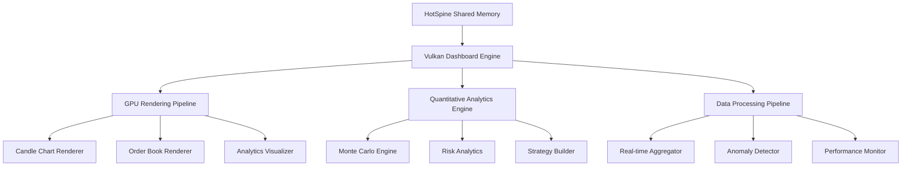
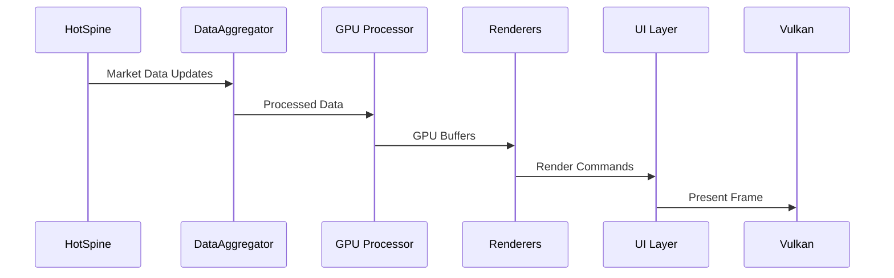
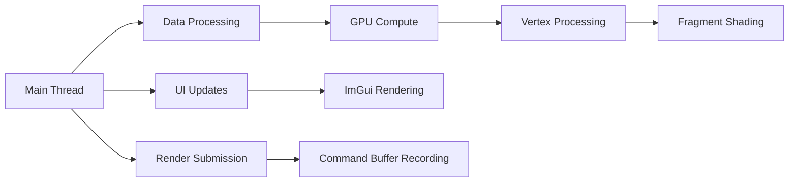

<!-- # Advanced Vulkan Quantitative Trading Dashboard Architecture -->

## Executive Summary

This document outlines the architecture for an advanced Vulkan-based quantitative trading dashboard that excels in real-time performance, scalability, and modularity for high-frequency trading environments. The system integrates GPU-accelerated rendering with sophisticated quantitative analytics, targeting sub-millisecond latency.

## Core Requirements

### Performance Targets
- **Latency**: Sub-millisecond rendering and data processing
- **Throughput**: 10,000+ updates per second
- **Resolution**: 4K+ display support
- **Memory**: Efficient data structures for large datasets

### Key Components
1. **Candle Charts**: Multi-timeframe GPU-accelerated candlestick visualization
2. **Order Books**: Real-time depth-of-market displays with heatmaps
3. **Quantitative Tools**: Monte Carlo simulations, volatility surfaces, correlation matrices
4. **Analytics Engine**: Risk metrics, algorithmic strategy builders, backtesting

## Architecture Overview

### System Architecture



### Core Classes Design

#### 1. VulkanDashboardAdvanced

**Primary Interface Class**
```cpp
class VulkanDashboardAdvanced {
public:
    // Core initialization
    VulkanDashboardAdvanced(const DashboardConfig& config);
    ~VulkanDashboardAdvanced();

    // Main rendering loop
    void run();

    // Component management
    void addChart(const ChartConfig& config);
    void addOrderBook(const OrderBookConfig& config);
    void addAnalyticsPanel(const AnalyticsConfig& config);

    // Real-time data integration
    void updateMarketData(const HotSpineData& data);
    void updateOrderBook(const OrderBookSnapshot& snapshot);

private:
    // Vulkan core
    VulkanContext vulkan_context_;
    RenderPipeline render_pipeline_;

    // Component managers
    ChartManager chart_manager_;
    OrderBookManager orderbook_manager_;
    AnalyticsManager analytics_manager_;

    // Data processing
    DataAggregator data_aggregator_;
    PerformanceMonitor perf_monitor_;
};
```

#### 2. GPU-Accelerated Candle Chart System

**CandleChartRenderer Class**
```cpp
class CandleChartRenderer {
public:
    struct CandleVertex {
        glm::vec2 position;
        glm::vec4 color;
        float open, high, low, close;
        uint32_t timestamp;
    };

    struct CandleInstance {
        glm::mat4 transform;
        glm::vec4 color;
        float scale;
    };

    // GPU-accelerated rendering
    void renderCandles(const std::vector<CandleData>& candles,
                      const Viewport& viewport);

    // Interactive features
    void handleZoom(const ZoomEvent& event);
    void handlePan(const PanEvent& event);

    // Technical indicators
    void addIndicator(const IndicatorConfig& config);
    void updateIndicatorData(const std::vector<float>& data);

private:
    // Vulkan resources
    VkBuffer vertex_buffer_;
    VkBuffer instance_buffer_;
    VkDescriptorSet descriptor_set_;

    // Compute shaders for data processing
    VkPipeline compute_pipeline_;
    VkPipeline graphics_pipeline_;

    // Indicator overlays
    std::vector<IndicatorRenderer*> indicators_;
};
```

#### 3. Order Book Visualization Engine

**OrderBookRenderer Class**
```cpp
class OrderBookRenderer {
public:
    struct OrderBookVertex {
        glm::vec2 position;
        glm::vec4 color;
        float price, size;
        uint32_t level_index;
    };

    // Real-time depth visualization
    void renderDepth(const OrderBookSnapshot& snapshot);
    void renderHeatmap(const std::vector<OrderLevel>& levels);

    // GPU compute for aggregation
    void computeVolumeProfile(const OrderBookSnapshot& snapshot);
    void computeLiquidityAnalysis();

private:
    // Vulkan compute resources
    VkPipeline depth_compute_pipeline_;
    VkPipeline heatmap_pipeline_;

    // Data structures
    std::vector<OrderLevel> bid_levels_;
    std::vector<OrderLevel> ask_levels_;

    // Performance optimization
    CircularBuffer<OrderBookSnapshot> history_buffer_;
};
```

#### 4. Quantitative Analytics Framework

**AnalyticsEngine Class**
```cpp
class AnalyticsEngine {
public:
    // Monte Carlo simulation
    MonteCarloResult runMonteCarlo(const SimulationConfig& config);

    // Risk analytics
    RiskMetrics calculateRiskMetrics(const PortfolioData& portfolio);

    // Volatility surface
    VolatilitySurface computeVolatilitySurface(const OptionData& options);

    // Correlation analysis
    CorrelationMatrix computeCorrelations(const std::vector<TimeSeries>& series);

private:
    // GPU compute kernels
    VkPipeline monte_carlo_pipeline_;
    VkPipeline risk_pipeline_;
    VkPipeline correlation_pipeline_;

    // Memory management
    GPUMemoryPool memory_pool_;
};
```

### Data Flow Architecture

#### Real-time Data Pipeline



#### Memory Management Strategy

**GPUMemoryPool Class**
```cpp
class GPUMemoryPool {
public:
    // Efficient memory allocation
    VkBuffer allocateBuffer(VkDeviceSize size, VkBufferUsageFlags usage);
    void deallocateBuffer(VkBuffer buffer);

    // Memory defragmentation
    void defragment();

    // Performance monitoring
    MemoryStats getStats();

private:
    // Memory arenas
    std::vector<MemoryArena> arenas_;

    // Allocation tracking
    std::unordered_map<VkBuffer, AllocationInfo> allocations_;
};
```

### Shader Architecture

#### SPIR-V Shader System

**ShaderManager Class**
```cpp
class ShaderManager {
public:
    // Dynamic shader compilation
    VkShaderModule compileShader(const std::string& glsl_source,
                               VkShaderStageFlagBits stage);

    // Shader specialization
    VkPipeline createSpecializedPipeline(const PipelineConfig& config);

    // Hot reloading for development
    void reloadShader(const std::string& name);

private:
    // Shader cache
    std::unordered_map<std::string, VkShaderModule> shader_cache_;

    // Specialization constants
    std::vector<VkSpecializationMapEntry> specialization_entries_;
};
```

#### Compute Shader Kernels

1. **Candle Processing Kernel**
```glsl
#version 450
layout(local_size_x = 256) in;

layout(binding = 0) buffer CandleBuffer {
    CandleData candles[];
};

layout(binding = 1) buffer IndicatorBuffer {
    float indicators[];
};

void main() {
    uint idx = gl_GlobalInvocationID.x;
    // Compute technical indicators
    // Update candle data
}
```

2. **Order Book Aggregation Kernel**
```glsl
#version 450
layout(local_size_x = 128) in;

layout(binding = 0) buffer OrderBookBuffer {
    OrderLevel levels[];
};

layout(binding = 1) buffer AggregatedBuffer {
    AggregatedData aggregated[];
};

void main() {
    uint idx = gl_GlobalInvocationID.x;
    // Aggregate order book depth
    // Compute liquidity metrics
}
```

### Multi-threading Architecture

#### Thread Management

**ThreadPool Class**
```cpp
class ThreadPool {
public:
    // Task scheduling
    void submitTask(std::function<void()> task);
    void submitRenderTask(RenderTask task);

    // Synchronization
    void waitForCompletion();
    void synchronizeGPU();

private:
    // Worker threads
    std::vector<std::thread> workers_;

    // Task queues
    moodycamel::ConcurrentQueue<Task> task_queue_;

    // GPU synchronization
    VkSemaphore gpu_semaphore_;
};
```

#### Parallel Rendering Pipeline



### Performance Optimization Strategies

#### 1. Data Structure Optimization

**Cache-Aligned Structures**
```cpp
struct alignas(64) MarketData {
    double price;
    double volume;
    uint64_t timestamp;
    uint32_t symbol_id;
    uint8_t flags;
};

struct alignas(64) OrderBookLevel {
    double price;
    double size;
    uint32_t count;
    uint8_t side; // 0=bid, 1=ask
};
```

#### 2. Memory Layout Optimization

**SoA (Struct of Arrays) Layout**
```cpp
struct CandleDataSoA {
    std::vector<float> opens;
    std::vector<float> highs;
    std::vector<float> lows;
    std::vector<float> closes;
    std::vector<uint64_t> timestamps;
    std::vector<uint32_t> volumes;
};
```

#### 3. GPU Memory Management

**Persistent Mapped Buffers**
```cpp
class PersistentBuffer {
public:
    void* map();
    void unmap();
    void flushRange(VkDeviceSize offset, VkDeviceSize size);

private:
    VkBuffer buffer_;
    VkDeviceMemory memory_;
    void* mapped_ptr_;
};
```

### Error Handling and Resilience

#### Anomaly Detection System

**AnomalyDetector Class**
```cpp
class AnomalyDetector {
public:
    // Market data validation
    bool validateTrade(const TradeData& trade);
    bool validateOrderBook(const OrderBookSnapshot& snapshot);

    // Performance monitoring
    void monitorLatency(const std::chrono::microseconds& latency);
    void monitorFrameRate(double fps);

    // Recovery mechanisms
    void handleDataGap();
    void handleRenderingFailure();

private:
    // Statistical models
    std::unique_ptr<StatisticalModel> latency_model_;
    std::unique_ptr<StatisticalModel> data_quality_model_;
};
```

### Plugin System Architecture

#### Plugin Interface

**DashboardPlugin Interface**
```cpp
class DashboardPlugin {
public:
    virtual ~DashboardPlugin() = default;

    virtual std::string getName() const = 0;
    virtual std::string getVersion() const = 0;

    virtual bool initialize(const PluginConfig& config) = 0;
    virtual void shutdown() = 0;

    virtual void update(float delta_time) = 0;
    virtual void render(VkCommandBuffer cmd_buffer) = 0;

    virtual void handleEvent(const Event& event) = 0;
};
```

#### Plugin Manager

**PluginManager Class**
```cpp
class PluginManager {
public:
    // Plugin lifecycle
    bool loadPlugin(const std::string& path);
    void unloadPlugin(const std::string& name);

    // Plugin communication
    void broadcastEvent(const Event& event);
    PluginResponse sendMessage(const std::string& plugin_name,
                              const PluginMessage& message);

private:
    // Plugin registry
    std::unordered_map<std::string, std::unique_ptr<DashboardPlugin>> plugins_;

    // Inter-plugin communication
    MessageBus message_bus_;
};
```

### Testing and Benchmarking Framework

#### Performance Benchmarks

**BenchmarkSuite Class**
```cpp
class BenchmarkSuite {
public:
    // Rendering benchmarks
    BenchmarkResult benchmarkRendering(uint32_t iterations);

    // Data processing benchmarks
    BenchmarkResult benchmarkDataProcessing(uint32_t data_points);

    // Memory usage benchmarks
    BenchmarkResult benchmarkMemoryUsage();

    // Latency measurements
    LatencyStats measureLatency();

private:
    // Benchmark infrastructure
    Timer timer_;
    MemoryProfiler memory_profiler_;
    FrameProfiler frame_profiler_;
};
```

#### Unit Testing Framework

**Test Framework Integration**
```cpp
// Test fixtures
class VulkanDashboardTest : public ::testing::Test {
protected:
    void SetUp() override {
        // Initialize Vulkan context
        // Setup test data
    }

    void TearDown() override {
        // Cleanup resources
    }
};

// Mock objects for testing
class MockHotSpineReader : public HotSpineReader {
    // Mock implementation
};
```

### Configuration Management

#### Configuration System

**DashboardConfig Structure**
```yaml
vulkan_dashboard:
  resolution:
    width: 3840
    height: 2160
  performance:
    target_fps: 144
    max_latency_ms: 1.0
  rendering:
    msaa_samples: 4
    anisotropy: 16
  data_sources:
    - type: hotspine
      shm_path: "/dev/shm/btquant_hotspine"
  charts:
    - type: candle
      symbol: "BTCUSDT"
      timeframe: "1m"
      indicators: ["sma", "rsi", "macd"]
  analytics:
    - type: monte_carlo
      simulations: 10000
      time_horizon_days: 30
```

### Implementation Roadmap

#### Phase 1: Core Infrastructure (Week 1-2)
- [ ] Vulkan context initialization
- [ ] Basic rendering pipeline
- [ ] HotSpine data integration
- [ ] Memory management system

#### Phase 2: Chart Rendering (Week 3-4)
- [ ] Candle chart renderer
- [ ] GPU-accelerated indicators
- [ ] Interactive zooming/panning
- [ ] Multi-timeframe support

#### Phase 3: Order Book System (Week 5-6)
- [ ] Order book renderer
- [ ] Depth visualization
- [ ] Heatmap generation
- [ ] Real-time updates

#### Phase 4: Analytics Engine (Week 7-8)
- [ ] Monte Carlo simulations
- [ ] Risk analytics
- [ ] Correlation matrices
- [ ] Strategy builder

#### Phase 5: Optimization & Testing (Week 9-10)
- [ ] Performance optimization
- [ ] Comprehensive testing
- [ ] Benchmarking suite
- [ ] Documentation

### Success Metrics

#### Performance Targets
- **Rendering Latency**: < 1ms per frame
- **Data Processing**: < 100μs per update
- **Memory Usage**: < 500MB for typical usage
- **Frame Rate**: 120+ FPS at 4K resolution

#### Quality Metrics
- **Test Coverage**: > 90%
- **Memory Safety**: Zero leaks in production
- **Thread Safety**: Race-condition free
- **Maintainability**: Modular, well-documented code

This architecture provides a solid foundation for building a world-class quantitative trading dashboard that can handle the demands of high-frequency trading while maintaining excellent user experience and extensibility.