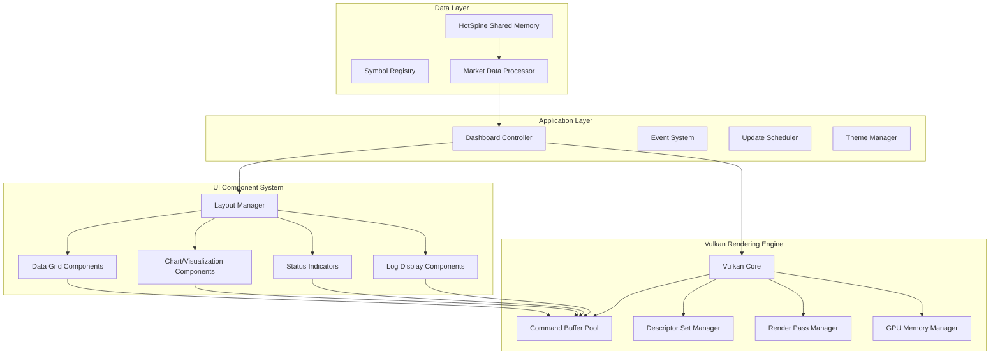

# BTQuant Advanced Vulkan Dashboard Architecture

## Executive Summary

This document outlines the architectural design for a cutting-edge financial trading dashboard built on Vulkan, designed to handle real-time market data visualization with professional-grade performance and aesthetics. The system will transform the current basic X11 window implementation into a sophisticated, GPU-accelerated trading interface capable of competing with industry-leading platforms.

## Current State Analysis

### Existing Implementation Limitations

The current [`vulkan_dashboard_advanced.hpp`](dependencies/BTQ_Render_Engine/include/vulkan_dashboard_advanced.hpp) implementation has several critical gaps:

1. **No Vulkan Rendering**: Despite including Vulkan headers, no actual Vulkan initialization or rendering occurs
2. **Basic X11 Window**: Only creates a simple X11 window with event handling
3. **Sleep-based Loop**: Uses `std::this_thread::sleep_for(16ms)` instead of proper frame timing
4. **No UI Components**: Missing all dashboard functionality, data visualization, and UI elements
5. **No Data Integration**: No connection to the HotSpine market data system
6. **Missing Modern Features**: No MSAA, compute shaders, or advanced rendering techniques

### HotSpine Data System Integration Points

The existing HotSpine system provides:
- **Shared Memory Layout**: [`hotspine_layout.hpp`](dependencies/ccapi/example/src/hotspine/hotspine_layout.hpp) defines data structures
- **Real-time Trade Data**: `HotTrade` structure with microsecond timestamps
- **Order Book Data**: `HotOrderbookSnapshot` with 20-level depth
- **Lock-free Access**: Atomic operations for high-performance data access
- **Symbol Registry**: Dynamic symbol ID mapping system

## System Architecture Overview



## Core Architecture Components

### 1. Vulkan Rendering Engine

#### VulkanCore Class
```cpp
class VulkanCore {
public:
    struct Config {
        bool enable_validation_layers = true;
        bool enable_msaa = true;
        VkSampleCountFlagBits msaa_samples = VK_SAMPLE_COUNT_4_BIT;
        bool enable_hdr = true;
        VkColorSpaceKHR color_space = VK_COLOR_SPACE_SRGB_NONLINEAR_KHR;
    };
    
private:
    VkInstance instance_;
    VkPhysicalDevice physical_device_;
    VkDevice device_;
    VkQueue graphics_queue_;
    VkQueue present_queue_;
    VkQueue compute_queue_;
    VkSurfaceKHR surface_;
    VkSwapchainKHR swapchain_;
    std::vector<VkImage> swapchain_images_;
    std::vector<VkImageView> swapchain_image_views_;
    std::vector<VkFramebuffer> framebuffers_;
};
```

#### Command Buffer Management
- **Multi-threaded Command Recording**: Separate command pools per thread
- **Double Buffering**: Primary and secondary command buffers for smooth updates
- **GPU-driven Rendering**: Indirect draw commands for UI elements
- **Compute Integration**: Compute shaders for data processing and layout calculations

#### Memory Management Strategy
```cpp
class GPUMemoryManager {
public:
    struct BufferAllocation {
        VkBuffer buffer;
        VkDeviceMemory memory;
        void* mapped_ptr;
        VkDeviceSize size;
        VkDeviceSize offset;
    };
    
    // Specialized allocators for different data types
    BufferAllocation allocate_vertex_buffer(VkDeviceSize size);
    BufferAllocation allocate_uniform_buffer(VkDeviceSize size);
    BufferAllocation allocate_storage_buffer(VkDeviceSize size);
    
private:
    // Memory pools for different usage patterns
    std::unique_ptr<MemoryPool> vertex_pool_;
    std::unique_ptr<MemoryPool> uniform_pool_;
    std::unique_ptr<MemoryPool> storage_pool_;
};
```

### 2. UI Component System

#### Component Hierarchy
```cpp
class UIComponent {
public:
    virtual ~UIComponent() = default;
    virtual void update(float delta_time) = 0;
    virtual void render(VkCommandBuffer cmd) = 0;
    virtual void handle_input(const InputEvent& event) = 0;
    
protected:
    glm::vec2 position_;
    glm::vec2 size_;
    bool visible_ = true;
    bool dirty_ = true;
};

class DataGridComponent : public UIComponent {
public:
    struct CellData {
        std::string text;
        glm::vec4 color;
        float value;
        bool highlight;
    };
    
    void set_data(const std::vector<std::vector<CellData>>& data);
    void set_column_widths(const std::vector<float>& widths);
    void enable_sorting(size_t column, bool ascending = true);
    
private:
    std::vector<std::vector<CellData>> grid_data_;
    std::vector<float> column_widths_;
    VkBuffer vertex_buffer_;
    VkBuffer index_buffer_;
    size_t vertex_count_;
};
```

#### Advanced Visualization Components
```cpp
class HeatmapComponent : public UIComponent {
public:
    struct HeatmapData {
        float value;
        glm::vec4 color;
        std::string label;
    };
    
    void set_data(const std::vector<std::vector<HeatmapData>>& data);
    void set_color_scheme(const ColorScheme& scheme);
    void enable_interpolation(bool enable);
    
private:
    VkBuffer compute_buffer_;
    VkDescriptorSet compute_descriptor_set_;
    VkPipeline compute_pipeline_;
};

class RealtimeChartComponent : public UIComponent {
public:
    void add_data_point(float timestamp, float value);
    void set_time_window(float seconds);
    void enable_candlestick_mode(bool enable);
    
private:
    std::deque<DataPoint> data_points_;
    VkBuffer line_vertex_buffer_;
    VkBuffer candlestick_vertex_buffer_;
    float time_window_ = 60.0f;
};
```

### 3. Data Integration Layer

#### HotSpine Data Processor
```cpp
class MarketDataProcessor {
public:
    struct ProcessedTrade {
        uint32_t symbol_id;
        double price;
        double size;
        uint64_t timestamp;
        bool is_buy;
        double price_change;
        double volume_weighted_price;
    };
    
    struct ProcessedOrderbook {
        uint32_t symbol_id;
        std::array<OrderbookLevel, 20> bids;
        std::array<OrderbookLevel, 20> asks;
        double spread;
        double mid_price;
        uint64_t timestamp;
    };
    
    void start_processing();
    void stop_processing();
    
    // Thread-safe data access
    std::vector<ProcessedTrade> get_recent_trades(uint32_t symbol_id, size_t count = 100);
    ProcessedOrderbook get_latest_orderbook(uint32_t symbol_id);
    
private:
    std::unique_ptr<HotSpine::HotSpineReader> reader_;
    std::thread processing_thread_;
    moodycamel::ConcurrentQueue<ProcessedTrade> trade_queue_;
    std::unordered_map<uint32_t, ProcessedOrderbook> latest_orderbooks_;
};
```

#### Real-time Data Streaming
```cpp
class DataStreamManager {
public:
    template<typename T>
    void subscribe(const std::string& channel, std::function<void(const T&)> callback);
    
    void publish_trade_update(const ProcessedTrade& trade);
    void publish_orderbook_update(const ProcessedOrderbook& orderbook);
    void publish_price_change(uint32_t symbol_id, double change_percent);
    
private:
    std::unordered_map<std::string, std::vector<std::function<void(const void*)>>> subscribers_;
    std::mutex subscribers_mutex_;
};
```

### 4. Performance Optimization Strategies

#### GPU-Driven Rendering
```cpp
struct DrawCommand {
    uint32_t vertex_count;
    uint32_t instance_count;
    uint32_t first_vertex;
    uint32_t first_instance;
};

class GPUDrivenRenderer {
public:
    void add_draw_command(const DrawCommand& cmd);
    void execute_indirect_draw(VkCommandBuffer cmd_buffer);
    
private:
    VkBuffer indirect_buffer_;
    std::vector<DrawCommand> pending_commands_;
};
```

#### Instanced Rendering for UI Elements
```cpp
struct UIInstanceData {
    glm::mat4 transform;
    glm::vec4 color;
    glm::vec4 uv_bounds;
    uint32_t texture_id;
};

class InstancedUIRenderer {
public:
    void add_instance(const UIInstanceData& instance);
    void render_all_instances(VkCommandBuffer cmd_buffer);
    
private:
    VkBuffer instance_buffer_;
    std::vector<UIInstanceData> instances_;
    size_t max_instances_ = 10000;
};
```

#### Compute Shader Integration
```cpp
class ComputeShaderManager {
public:
    // Data processing shaders
    void dispatch_price_calculation(const std::vector<TradeData>& trades);
    void dispatch_heatmap_generation(const std::vector<float>& values);
    void dispatch_text_layout(const std::vector<TextElement>& elements);
    
    // Results retrieval
    std::vector<float> get_computed_prices();
    std::vector<glm::vec4> get_heatmap_colors();
    
private:
    VkPipeline price_calc_pipeline_;
    VkPipeline heatmap_pipeline_;
    VkPipeline text_layout_pipeline_;
    
    VkBuffer compute_input_buffer_;
    VkBuffer compute_output_buffer_;
};
```

### 5. Modern Rendering Features

#### Multi-sampling Anti-aliasing (MSAA)
```cpp
class MSAAManager {
public:
    void initialize(VkSampleCountFlagBits sample_count);
    void create_msaa_resources(VkExtent2D extent);
    void resolve_msaa(VkCommandBuffer cmd_buffer);
    
private:
    VkImage msaa_color_image_;
    VkImageView msaa_color_image_view_;
    VkDeviceMemory msaa_color_memory_;
    VkSampleCountFlagBits msaa_samples_;
};
```

#### Dynamic Font Rendering
```cpp
class FontRenderer {
public:
    struct GlyphMetrics {
        float advance_x;
        float advance_y;
        float bearing_x;
        float bearing_y;
        float width;
        float height;
    };
    
    void load_font(const std::string& font_path, float size);
    void render_text(const std::string& text, glm::vec2 position, glm::vec4 color);
    
private:
    struct FontAtlas {
        VkImage texture;
        VkImageView texture_view;
        std::unordered_map<char32_t, GlyphMetrics> glyph_metrics;
    };
    
    FontAtlas atlas_;
    VkBuffer text_vertex_buffer_;
};
```

#### HDR and Color Space Management
```cpp
class ColorSpaceManager {
public:
    void initialize_hdr_support();
    void set_color_space(VkColorSpaceKHR color_space);
    void apply_tone_mapping(VkCommandBuffer cmd_buffer);
    
private:
    VkColorSpaceKHR current_color_space_;
    VkPipeline tone_mapping_pipeline_;
    bool hdr_enabled_ = false;
};
```

## Dashboard Layout Design

### Professional Trading Interface Layout
```
┌─────────────────────────────────────────────────────────────────────────────────┐
│ BTQuant Dashboard                                    [●] Connected  Latency: 2ms │
├─────────────────────────────────────────────────────────────────────────────────┤
│                                                                                 │
│  ┌─────────────────────────────────────┐  ┌─────────────────────────────────────┐ │
│  │           Symbol Grid               │  │         Momentum Heatmap            │ │
│  │  Symbol    Price    Change   Volume │  │  ┌───┬───┬───┬───┬───┬───┬───┬───┐  │ │
│  │  BTCUSDT   67,234   +2.34%   1.2M  │  │  │ + │ + │ - │ + │ + │ - │ + │ + │  │ │
│  │  ETHUSDT   3,456    -1.23%   890K  │  │  │ + │ - │ - │ + │ - │ - │ + │ - │  │ │
│  │  ADAUSDT   0.456    +5.67%   2.1M  │  │  │ - │ + │ + │ - │ + │ + │ - │ + │  │ │
│  │  DOGEUSDT  0.123    -0.89%   3.4M  │  │  │ + │ + │ - │ + │ + │ - │ + │ + │  │ │
│  │  BNBUSDT   456.78   +3.21%   567K  │  │  └───┴───┴───┴───┴───┴───┴───┴───┘  │ │
│  │  SOLUSDT   89.12    -2.45%   1.8M  │  │                                     │ │
│  └─────────────────────────────────────┘  └─────────────────────────────────────┘ │
│                                                                                 │
│  ┌─────────────────────────────────────┐  ┌─────────────────────────────────────┐ │
│  │         Order Book (BTCUSDT)        │  │           Price Chart               │ │
│  │   Bids          Price        Asks   │  │  ┌─────────────────────────────────┐ │ │
│  │  1.234  │  67,230.00  │  0.567     │  │  │    ╭─╮                         │ │ │
│  │  2.456  │  67,229.50  │  1.234     │  │  │   ╱   ╲     ╭─╮                │ │ │
│  │  0.789  │  67,229.00  │  2.890     │  │  │  ╱     ╲   ╱   ╲               │ │ │
│  │  3.567  │  67,228.50  │  0.456     │  │  │ ╱       ╲ ╱     ╲              │ │ │
│  │  1.890  │  67,228.00  │  1.678     │  │  │╱         ╲       ╲─╮           │ │ │
│  └─────────────────────────────────────┘  │  └─────────────────────────────────┘ │ │
│                                           └─────────────────────────────────────┘ │
│  ┌─────────────────────────────────────────────────────────────────────────────┐ │
│  │                              System Log                                     │ │
│  │  [23:45:12] Connected to Binance WebSocket                                 │ │
│  │  [23:45:13] Market data streaming started for 6 symbols                   │ │
│  │  [23:45:14] BTCUSDT: Large trade detected - 15.67 BTC @ $67,234           │ │
│  │  [23:45:15] System health: OK | Memory: 234MB | CPU: 12%                  │ │
│  └─────────────────────────────────────────────────────────────────────────────┘ │
└─────────────────────────────────────────────────────────────────────────────────┘
```

### Theme System
```cpp
struct DashboardTheme {
    // Background colors
    glm::vec4 background_primary = {0.1f, 0.1f, 0.1f, 1.0f};
    glm::vec4 background_secondary = {0.15f, 0.15f, 0.15f, 1.0f};
    
    // Text colors
    glm::vec4 text_primary = {0.9f, 0.9f, 0.9f, 1.0f};
    glm::vec4 text_secondary = {0.7f, 0.7f, 0.7f, 1.0f};
    
    // Market data colors
    glm::vec4 price_up = {0.0f, 0.8f, 0.0f, 1.0f};
    glm::vec4 price_down = {0.8f, 0.0f, 0.0f, 1.0f};
    glm::vec4 price_neutral = {0.6f, 0.6f, 0.6f, 1.0f};
    
    // UI accent colors
    glm::vec4 accent_primary = {0.2f, 0.6f, 1.0f, 1.0f};
    glm::vec4 accent_secondary = {0.8f, 0.4f, 0.0f, 1.0f};
};
```

## Implementation Phases

### Phase 1: Core Vulkan Infrastructure (Priority: Critical)
- [ ] Vulkan instance and device initialization
- [ ] Swapchain and render pass setup
- [ ] Basic command buffer management
- [ ] Memory allocation system
- [ ] MSAA support implementation

### Phase 2: Basic UI Framework (Priority: High)
- [ ] UI component base classes
- [ ] Text rendering system
- [ ] Basic geometric primitives
- [ ] Input handling system
- [ ] Layout management

### Phase 3: Data Integration (Priority: High)
- [ ] HotSpine reader integration
- [ ] Market data processing pipeline
- [ ] Real-time data streaming
- [ ] Symbol registry integration
- [ ] Data validation and error handling

### Phase 4: Dashboard Components (Priority: Medium)
- [ ] Data grid component
- [ ] Price chart component
- [ ] Order book visualization
- [ ] Status indicators
- [ ] Log display system

### Phase 5: Advanced Features (Priority: Medium)
- [ ] Heatmap visualization
- [ ] Compute shader integration
- [ ] GPU-driven rendering
- [ ] Advanced animations
- [ ] Performance profiling tools

### Phase 6: Optimization & Polish (Priority: Low)
- [ ] Frame pacing optimization
- [ ] Memory usage optimization
- [ ] HDR support
- [ ] Advanced color management
- [ ] Accessibility features

## Performance Targets

### Rendering Performance
- **Frame Rate**: Consistent 60 FPS with 1000+ UI elements
- **Latency**: < 1ms from data update to screen display
- **Memory Usage**: < 512MB GPU memory for full dashboard
- **CPU Usage**: < 15% on modern multi-core systems

### Data Processing Performance
- **Trade Processing**: > 100,000 trades/second
- **Order Book Updates**: > 10,000 updates/second
- **UI Update Rate**: 60 Hz for smooth animations
- **Data Latency**: < 100μs from HotSpine to UI update

## Integration Points with Existing Systems

### HotSpine Integration
```cpp
class DashboardDataSource {
public:
    void initialize(const std::string& shm_name = "/btquant_hotspine");
    void start_monitoring();
    void stop_monitoring();
    
    // Event-driven data updates
    void on_trade_received(std::function<void(const ProcessedTrade&)> callback);
    void on_orderbook_updated(std::function<void(const ProcessedOrderbook&)> callback);
    
private:
    std::unique_ptr<HotSpine::HotSpineReader> reader_;
    MarketDataProcessor processor_;
    DataStreamManager stream_manager_;
};
```

### Symbol Registry Integration
```cpp
class DashboardSymbolManager {
public:
    void load_symbol_mappings(const std::string& json_path = "/dev/shm/btquant_symbols.json");
    std::string get_symbol_name(uint32_t symbol_id);
    uint32_t get_symbol_id(const std::string& exchange, const std::string& symbol);
    
private:
    BTQuant::SymbolRegistry& registry_;
    std::unordered_map<uint32_t, std::string> id_to_name_;
};
```

## Risk Mitigation & Error Handling

### Vulkan Error Handling
```cpp
class VulkanErrorHandler {
public:
    static void check_result(VkResult result, const std::string& operation);
    static void setup_debug_messenger(VkInstance instance);
    
private:
    static VkDebugUtilsMessengerEXT debug_messenger_;
};
```

### Data Validation
```cpp
class DataValidator {
public:
    bool validate_trade(const HotSpine::HotTrade& trade);
    bool validate_orderbook(const HotSpine::HotOrderbookSnapshot& orderbook);
    void log_validation_error(const std::string& error);
    
private:
    std::atomic<uint64_t> validation_errors_{0};
};
```

### Graceful Degradation
- **GPU Memory Exhaustion**: Automatic quality reduction
- **Data Stream Interruption**: Cached data display with warnings
- **Vulkan Driver Issues**: Fallback to software rendering
- **Performance Degradation**: Adaptive frame rate and quality scaling

## Conclusion

This architecture provides a comprehensive foundation for building a cutting-edge financial trading dashboard that leverages modern Vulkan rendering techniques while integrating seamlessly with the existing HotSpine market data infrastructure. The modular design ensures maintainability and extensibility, while the performance optimizations guarantee professional-grade responsiveness required for real-time trading applications.

The implementation phases are structured to deliver value incrementally, with critical infrastructure components prioritized to establish a solid foundation before adding advanced visualization features. The architecture supports future enhancements such as multi-monitor setups, 3D visualizations, and machine learning-driven market analysis displays.